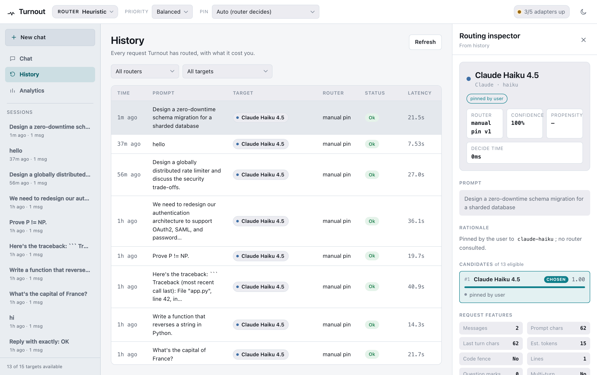
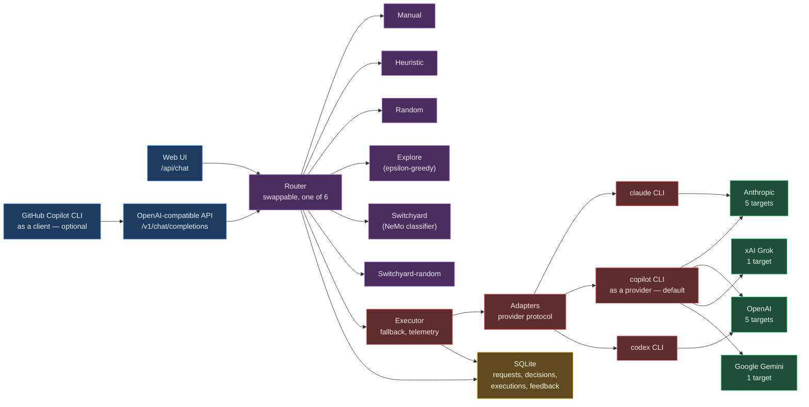

# Turnout

**A local model router that shows its work.**

[](https://github.com/enu235/turnout/actions/workflows/ci.yml)
[](https://www.python.org/downloads/)
[](LICENSE)

Turnout sits between your client and a set of model providers and decides, on every request,
which model actually answers. A **swappable router** makes that decision, and every decision
is recorded with the full ranked candidate list and the reasons each candidate won or lost.
That is the whole pitch: the same job GitHub Copilot's `auto` picker does silently, except you
can see it, change it, and log it.

Thirteen live targets across four vendors — Anthropic, OpenAI, xAI, and Google — are reachable
with **zero API keys**, because every one of them is fronted by a local CLI (`claude`,
`copilot`, `codex`) that is already logged in. Everything lands in SQLite: the prompt, the
feature vector the router saw, the candidate scores, latency, cost, outcomes — a dataset built
for training a better router later, not just a chat log.

<!-- Drop a screenshot of the routing inspector at docs/images/inspector.png -->


## Architecture

A request comes in through one of two front doors, is handed to whichever router is currently
active, and the resulting decision is executed by a layer that knows nothing about routing and
routers that know nothing about providers.

Note that the Copilot CLI appears twice, in two unrelated roles. As a **provider** it is how
Turnout reaches seven of its targets, and it uses your ordinary Copilot login — nothing to
configure. As a **client** it is an optional extra: you can point Copilot CLI back at Turnout
so that Turnout's router replaces Copilot's own model picker. Only that second role involves
BYOK, and you can ignore it entirely.



Two of the six routers (Switchyard, Switchyard-random) delegate the decision to
[NVIDIA NeMo Switchyard](https://github.com/NVIDIA-NeMo/Switchyard) over HTTP — see
[**NVIDIA NeMo Switchyard is optional**](#nvidia-nemo-switchyard-optional) below.

## Install

**Prerequisites**

- Python 3.12+
- [uv](https://docs.astral.sh/uv/)
- At least one provider CLI, logged in to your own account:
  - [`claude`](https://claude.com/claude-code) — `claude auth login`
  - [`copilot`](https://github.com/github/copilot-cli) — `copilot login`
  - [`codex`](https://github.com/openai/codex) — `codex login`

Turnout runs these as local subprocesses. It never reads credential files or the system
keychain — each CLI authenticates itself.

**Install it as a tool** — nothing to clone:

```bash
uv tool install git+https://github.com/enu235/turnout

mkdir my-turnout && cd my-turnout
turnout init            # writes a starting turnout.toml here
turnout check           # which provider CLIs can it actually reach?
turnout serve           # http://127.0.0.1:8700
```

`turnout init` drops the model catalog in the current directory; the database and any
generated files are created next to it, so the directory you run from is the whole of your
state. Edit `turnout.toml` to add or remove models.

**Or work on it** — clone if you want to change the code:

```bash
git clone https://github.com/enu235/turnout
cd turnout
uv venv && uv pip install -e '.[dev]'
source .venv/bin/activate

turnout check
```

Real output, from this checkout:

```
$ turnout check
config      turnout.toml
database    /path/to/turnout/data/turnout.db
router      heuristic   (available: manual, heuristic, random, explore, switchyard, switchyard-random)

adapters
  OK  claude_cli     2.1.240 (Claude Code)
  OK  codex_cli      codex-cli 0.149.0
  OK  copilot_cli    GitHub Copilot CLI 1.0.81-7.
  --  ollama         connection failed: All connection attempts failed
  --  xai            XAI_API_KEY not set

targets
  OK claude-haiku     claude_cli   haiku              q2 c1 s1
  OK claude-sonnet    claude_cli   sonnet             q4 c3 s2
  OK claude-opus      claude_cli   opus               q5 c5 s4
  OK copilot-auto     copilot_cli  auto               q3 c2 s2
  OK copilot-sonnet   copilot_cli  claude-sonnet-5    q4 c3 s2
  OK copilot-opus     copilot_cli  claude-opus-5      q5 c5 s4
  OK copilot-gpt-sol  copilot_cli  gpt-5.6-sol        q4 c3 s3
  OK copilot-gpt-54   copilot_cli  gpt-5.4            q4 c3 s2
  OK copilot-grok     copilot_cli  grok-4.5           q4 c3 s2
  OK copilot-gemini   copilot_cli  gemini-3.7-flash   q3 c1 s1
  OK codex-default    codex_cli    default            q4 c3 s3
  OK codex-sol        codex_cli    gpt-5.6-sol        q5 c4 s4
  OK codex-terra      codex_cli    gpt-5.6-terra      q4 c4 s3
  -- grok-4           xai          grok-4             q4 c3 s2  (disabled in config)
  -- ollama-local     ollama       llama3.2           q2 c1 s2  (disabled in config)
```

`OK`/`--` is whether the adapter answered; a target still needs `enabled = true` in
`turnout.toml` on top of that. The `q`/`c`/`s` numbers are quality (1–5, higher is better),
cost (1–5, lower is cheaper), and speed (1–5, lower is faster) — seed estimates that measured
history overrides once the database has a few executions per target.

You only need one working adapter to start; `check` just tells you which targets that gives
you. Fix whichever CLI shows `--` (usually a missing login), or ignore it and route around it.

**Run it**

```bash
turnout serve
```

Turnout listens on `http://127.0.0.1:8700` by default. Open that in a browser for the web UI,
or point any OpenAI-compatible client at `/v1/chat/completions`.

### NVIDIA NeMo Switchyard (optional)

Two of the six routers — `switchyard` and `switchyard-random` — delegate the decision to
[NVIDIA NeMo Switchyard](https://github.com/NVIDIA-NeMo/Switchyard), a separate Apache-2.0
project reached over HTTP. **No Switchyard source is vendored in this repo, and Turnout runs
fully without it** — you lose those two routers and keep the other four (`manual`,
`heuristic`, `random`, `explore`).

To enable it:

```bash
git clone https://github.com/NVIDIA-NeMo/Switchyard
cd Switchyard && cargo build --release -p switchyard-server
```

Put the binary on your `PATH`, or point `turnout.toml` at it:

```toml
[switchyard]
binary = "/path/to/Switchyard/target/release/switchyard-server"
```

Then generate its config and start it:

```bash
turnout switchyard write-config
turnout switchyard serve      # or: turnout switchyard validate
```

See [docs/switchyard.md](docs/switchyard.md) for the `/v1/decision` contract this integration
speaks.

## Quick tour

**The web UI**, at `http://127.0.0.1:8700`, is a single-page app with no build step — plain
HTML, CSS, and JavaScript served off disk. It gives you:

- **A routing inspector.** Every reply carries the full decision: which router chose the
  target, its confidence and propensity, and the complete ranked candidate list with the
  reasons each one won or lost, next to the feature vector the router actually saw.
- **Live router switching.** Router, priority, and a hard pin to one target are all in the top
  bar; changing them changes the next request, nothing restarts.
- **Compare.** Send one prompt to several targets at once, see them answer side by side, and
  record which one won.
- **History and analytics.** Every past request, and per-target success rate, latency, and
  spend.

**The OpenAI-compatible API.** `POST /api/route` runs the router without calling a model, so
it costs nothing and is the easiest way to see a decision. Here it is, live, against the
`heuristic` default:

```bash
curl -s -X POST http://127.0.0.1:8700/api/route \
  -H "Content-Type: application/json" \
  -d '{"prompt": "What is 2+2?"}' | jq .
```

Real, trimmed output:

```json
{
  "request_id": "req_580b23e671a141e7",
  "features": {
    "n_messages": 1,
    "n_chars": 12,
    "has_code_fence": false,
    "priority": "balanced"
  },
  "decisions": [
    {
      "target_id": "claude-haiku",
      "router_name": "heuristic",
      "rationale": "difficulty 0.00, code affinity 0.00 -> `claude-haiku` (score +3.50, margin +0.00). Signals: -easy: lookup-style question; -easy: very short prompt (12 chars)",
      "confidence": 0.05,
      "propensity": 1.0,
      "explored": false,
      "eligible_ids": ["claude-haiku", "claude-sonnet", "claude-opus", "..."],
      "candidates": [
        {"target_id": "claude-haiku", "score": 3.5,
         "reasons": ["meets the bar: tier 2 >= required 1.0",
                     "balanced: prefer cheaper among capable (cost tier 1)"]},
        {"target_id": "copilot-gemini", "score": 3.5, "reasons": ["..."]}
      ]
    }
  ]
}
```

`POST /v1/chat/completions` runs the same decision and actually executes it — a normal OpenAI
chat completion, plus one extra, namespaced field: `turnout`, carrying `target_id`, `router`,
`rationale`, and `confidence`. Clients that don't know about it just ignore it and use the
completion. This endpoint spends real money or credits, so it isn't the one to poke at first.

```bash
curl -s -X POST http://127.0.0.1:8700/v1/chat/completions \
  -H "Content-Type: application/json" \
  -d '{"model": "auto", "messages": [{"role": "user", "content": "..."}]}'
```

Use `"model": "auto"` to invoke the active router, or name any target id (e.g.
`"claude-opus"`) to pin it.

## Optional: bring your own router to Copilot CLI

**You do not need this, and you do not need to set anything up with GitHub.** Skip this whole
section and Turnout still routes across all thirteen targets.

Despite the name, "bring your own key" is not an account setting or a plan you enable. It is
just a mode of the Copilot CLI that makes it talk to an OpenAI-compatible endpoint of your
choosing instead of GitHub's own backend, and it turns on purely from environment variables at
the moment you launch it. No key is involved when the endpoint is Turnout — GitHub's own
documentation notes that its authentication is not used in this mode at all.

Point Copilot CLI at Turnout and it uses your router instead of its own hidden `auto`:

```bash
$ turnout byok
Point GitHub Copilot CLI at Turnout:

  COPILOT_PROVIDER_BASE_URL=http://127.0.0.1:8700/v1
  COPILOT_PROVIDER_TYPE=openai
  COPILOT_PROVIDER_WIRE_API=completions
  COPILOT_MODEL=auto

  $ eval "$(turnout byok --export)" && copilot
```

Run that last line and `copilot` now talks to Turnout. Swap routers or change priorities on
Turnout and your next call routes differently — all of it recorded in the database. Pass
`--model` to pin one target instead of routing: `turnout byok --model claude-opus`.
`scripts/copilot-byok.sh` wraps the same environment if you prefer a script.

The variables live only in the shell you exported them into. Open a new terminal, or run
`copilot` without them, and you are back to ordinary Copilot with nothing changed — Turnout
never writes to Copilot's configuration.

This is separate from, and does not affect, Turnout's use of `copilot` as a *provider*. That
path is always on, needs no BYOK, and is how targets like `copilot-grok` and `copilot-gemini`
work: Turnout runs `copilot -p` under your normal login.

## The six routers

Only Manual, Heuristic, and Switchyard are meant as an everyday policy. Random, Explore, and
Switchyard-random exist to keep the logged data honest for whatever gets trained on it next —
a deterministic router only ever tries the targets it already likes, which is exactly the data
a learned router can't use.

| Router | Decision cost | What it does |
|---|---|---|
| **Manual** | 0 ms | Always the configured default target. No intelligence, no latency — the control condition every other router has to beat. |
| **Heuristic** | 0 ms | Scores every eligible target on capability, cost, and speed from visible text signals (code markers, security language, conversation length), with session affinity to avoid breaking prompt caches. Measured failure rate and time-to-first-token override the initial estimates once there's history. Every score comes with named reasons. |
| **Random** | 0 ms | Uniform over eligible targets, sampling probability recorded on every decision. Generates the target-by-prompt-type coverage a learned router needs. |
| **Explore** | 0 ms | Heuristic wrapped in epsilon-greedy (`epsilon=0.1`): follows Heuristic 90% of the time, samples uniformly the other 10%, and records the true selection probability either way. |
| **Switchyard** | ~20 s | Calls NeMo Switchyard's `switchyard/classifier` route: a cheap model judges task difficulty once per new session before the request goes to a strong or weak target. A real model call, so it's the slowest router here. |
| **Switchyard-random** | ~14 ms | Calls Switchyard's `switchyard/random` route — instant, uniform, another exploration source, distinct from the in-process `Random` router because it's Switchyard's own baseline. |

## Target catalog

Read straight out of `turnout.toml`. 13 targets are live today; two more ship disabled.

| ID | Adapter | Model | Quality | Cost | Speed | Notes |
|---|---|---|---|---|---|---|
| `claude-haiku` | Claude CLI | haiku | 2 | 1 | 1 | Cheap and quick. The right answer for most short prompts. |
| `claude-sonnet` | Claude CLI | sonnet | 4 | 3 | 2 | The general-purpose workhorse. |
| `claude-opus` | Claude CLI | opus | 5 | 5 | 4 | Reserved for genuinely hard work; expensive per token. |
| `copilot-auto` | Copilot CLI | auto | 3 | 2 | 2 | Copilot's own opaque picker; resolved to Haiku 4.5 when measured. Kept as the baseline this project exists to beat. |
| `copilot-sonnet` | Copilot CLI | claude-sonnet-5 | 4 | 3 | 2 | ~0.92 credits on a short call. |
| `copilot-opus` | Copilot CLI | claude-opus-5 | 5 | 5 | 4 | ~2.32 credits on a short call — the most expensive target here. |
| `copilot-gpt-sol` | Copilot CLI | gpt-5.6-sol | 4 | 3 | 3 | ~0.96 credits. |
| `copilot-gpt-54` | Copilot CLI | gpt-5.4 | 4 | 3 | 2 | ~1.00 credits. |
| `copilot-grok` | Copilot CLI | grok-4.5 | 4 | 3 | 2 | xAI without an xAI key — Copilot fronts it. |
| `copilot-gemini` | Copilot CLI | gemini-3.7-flash | 3 | 1 | 1 | The cheap, fast option on the Copilot side. |
| `codex-default` | Codex CLI | default | 4 | 3 | 3 | OpenAI via the Codex CLI and its ChatGPT subscription auth. Codex returns whole messages, not token deltas. |
| `codex-sol` | Codex CLI | gpt-5.6-sol | 5 | 4 | 4 | The strongest Codex option; slower, and not incremental. |
| `codex-terra` | Codex CLI | gpt-5.6-terra | 4 | 4 | 3 | — |

Disabled by default, in `turnout.toml`:

| ID | Adapter | Model | Needs |
|---|---|---|---|
| `grok-4` | xAI (direct) | grok-4 | `XAI_API_KEY`. Copilot already exposes `grok-4.5` without one. |
| `ollama-local` | Ollama | llama3.2 | A local `ollama serve` with the model pulled. Fully offline. |

Cost is reported the way each provider reports it and never converted: **Claude CLI reports
real USD**, **Copilot CLI reports AI credits**, **Codex CLI reports neither**.

## Configuration

Everything Turnout knows about the outside world lives in [`turnout.toml`](turnout.toml).
Adding a model is an edit to that file, never a code change — see
[CONTRIBUTING.md](CONTRIBUTING.md#adding-a-model).

Each target carries three seed estimates, 1–5:

- **`quality_tier`** — 1 weakest, 5 strongest
- **`cost_tier`** — 1 cheapest, 5 most expensive
- **`speed_tier`** — 1 fastest, 5 slowest

These are starting points for the Heuristic router, not measurements — once the `executions`
table has a few runs per target, measured latency and success rate start overriding them.

Point the CLI at a different file with `--config path/to/file.toml` or `TURNOUT_CONFIG`.
`TURNOUT_URL` tells `scripts/copilot-byok.sh` where Turnout is listening if not the default.
`TURNOUT_LIVE=1` unlocks the test suite that calls real providers (see below).

Full reference: [docs/routing.md](docs/routing.md) for how the heuristic scoring works,
[docs/adapters.md](docs/adapters.md) for the provider layer, and
[docs/database.md](docs/database.md) for the schema every decision lands in.

## Tests

```
$ pytest tests/ -q
.............................................ssssss.................     [100%]
62 passed, 6 skipped, 1 warning in 0.73s
```

The suite runs entirely against a stub adapter — no provider CLI, no network, no spend, which
is why it can run in CI on every push. The skips are `tests/test_live.py`, which calls the real
CLIs and costs money or credits:

```bash
TURNOUT_LIVE=1 pytest tests/test_live.py -q -s
```

## What this is not

- **Not a learned router yet.** The Heuristic weights are human-set starting points. The
  database and the `turnout export` command exist to train one; nothing has been trained yet.
- **Not a research system.** It's an MVP. The routers are simple by design, and the scope is
  one user on one machine.
- **Not a metered API.** `claude`, `copilot`, and `codex` are subscription CLIs, not billed
  APIs — Turnout records usage but doesn't enforce quotas. Expect their normal limits: rate
  limiting, roughly 1–4 seconds of subprocess startup on every call, and a CLI that can simply
  be logged out from under you.
- **Not uniformly streaming.** Codex CLI returns whole messages rather than token deltas, so
  targets on that adapter arrive in one piece even when the client asked to stream.
- **Not a high-level framework.** This isn't `langchain` or a RAG stack. It sits lower: between
  a client and a model, making the routing decision visible and logged.

## Docs

- [architecture.md](docs/architecture.md) — the Router / Adapter / Executor split and the two
  front doors.
- [routing.md](docs/routing.md) — how each router decides, and how to write your own.
- [switchyard.md](docs/switchyard.md) — the `/v1/decision` contract and the generated config.
- [adapters.md](docs/adapters.md) — the provider layer and how to add one.
- [database.md](docs/database.md) — the schema and `turnout export`.
- [controls.md](docs/controls.md) — what each top-bar control does to a decision, with real
  before/after output.

To read the code instead, start at `turnout/domain.py`: three protocols define the whole
system, and everything else implements one of them.

## Contributing

See [CONTRIBUTING.md](CONTRIBUTING.md). The one rule that matters: routers decide, adapters
execute, and the executor runs the decision — mixing those concerns is the one change that
breaks this design. See also [SECURITY.md](SECURITY.md): Turnout binds `127.0.0.1` with no
authentication on any endpoint, which is fine for a single-user local tool and not fine to
expose further without putting auth in front of it.

## License

Apache License 2.0 — see [LICENSE](LICENSE).

Turnout is an independent project and is **not affiliated with, endorsed by, or sponsored by**
NVIDIA, Anthropic, GitHub, Microsoft, OpenAI, xAI, or Google. Full third-party attribution is
in [NOTICE](NOTICE).

## Acknowledgements

[NVIDIA NeMo Switchyard](https://github.com/NVIDIA-NeMo/Switchyard) is the router backend that
started this project — a look at its `/v1/decision` API and its classifier route was the seed
for Turnout's own Router protocol. Switchyard is optional and reached only over HTTP; no
Switchyard source is vendored here.
