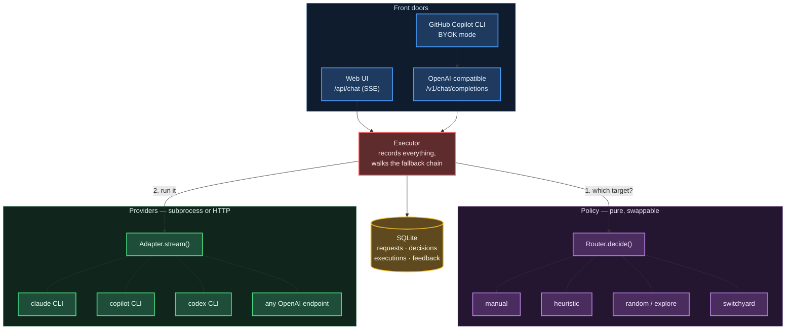
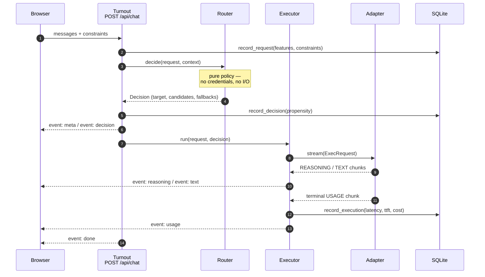

# Turnout Architecture

Turnout separates three concerns that are usually fused together, and that separation is what makes routing swappable:

- **Router** — decides WHICH target should serve a request. Pure: no credentials, no subprocesses, no retries.
- **Adapter** — knows HOW to reach one provider. Streams chunks. No opinion on model choice.
- **Executor** — glues them together, records every execution, walks the router's declared fallback chain.

Keeping the router pure means swapping out Switchyard is a one-line config change rather than a rewrite. The executor knows nothing of any particular strategy; it just walks what the router decided.

---



The arrows out of `Executor` are the whole design: it asks the router *which*, then
asks an adapter *how*. Neither of those two ever calls the other.

## The Three Interfaces

All three are defined as Python protocols in `domain.py`, making them structurally typed.

### Router

```python
@runtime_checkable
class Router(Protocol):
    """The swap point. Everything else in Turnout is router-agnostic."""

    name: str
    version: str

    async def decide(self, req: RoutingRequest, ctx: RoutingContext) -> Decision: ...

    async def health(self) -> tuple[bool, str]:
        """(ok, detail). Used by the UI and by the executor to fall back."""
        ...
```

The router sees:
- `RoutingRequest` — session id, messages, constraints (priority, allow-list, deny-list, cost cap, locality requirement, human pin)
- `RoutingContext` — the catalog, session history, per-target statistics

It returns a `Decision` — which target to use, rationale, a fallback chain, candidate scores, and confidence.

### Adapter

```python
@runtime_checkable
class Adapter(Protocol):
    """How to actually reach one provider family."""

    name: str

    async def probe(self) -> tuple[bool, str]:
        """Is this adapter usable right now? Cheap, no model call."""
        ...

    def stream(self, req: ExecRequest) -> AsyncIterator[Chunk]:
        """Yield chunks. MUST yield exactly one terminal USAGE or ERROR chunk."""
        ...
```

The adapter knows:
- Which provider (OpenAI, Claude, Copilot)
- How to marshal API calls
- How to parse responses into chunks

It yields:
- `TEXT` — user-visible tokens
- `REASONING` — thinking/intermediate steps
- `STATUS` — progress notes
- `USAGE` — cost and token counts (terminal)
- `ERROR` — failure (terminal)

An adapter yields exactly one terminal chunk (USAGE or ERROR).

### Executor

The executor is not a protocol — it's concrete. It holds the adapters, the target catalog, and the database — but not a router; a `Decision` is handed to it already made.

```python
class Executor:
    def __init__(self, adapters: dict[str, Adapter], catalog: TargetCatalog, db: Database):
        self.adapters = adapters
        self.catalog = catalog
        self.db = db

    async def run(
        self, req: RoutingRequest, decision: Decision, *,
        shadow: bool = False, max_fallbacks: int = 2,
    ) -> AsyncIterator[Chunk]:
        """Stream one logical response, transparently retrying down the fallback chain."""
```

The HTTP layer (`app.py`) records the incoming request, calls `router.decide()` to get a `Decision`, and records that decision — all before the executor is ever invoked. The executor itself:
- Receives an already-computed `Decision`; it never calls `router.decide()` itself
- Walks the fallback chain from the decision, not inventing its own
- Calls `adapter.stream()` for each target
- Records every execution to the database (requests and decisions are recorded by the HTTP layer, not the executor)
- Stops falling back once any TEXT has been emitted (to avoid Frankenstein answers)

---

## Request Flow: One Complete Journey

A request from a browser client goes through these stages:



SSE events sent back to the browser are named after the `ChunkKind`:
- `meta` — request id, session id, computed features
- `decision` — router name, target chosen, rationale, candidates, fallback chain
- `text` — tokens (streaming)
- `reasoning` — thinking (streaming)
- `status` — fallback notices, adapter progress
- `usage` — cost, tokens, execution id, timing (terminal)
- `error` — failure message (terminal)

---

## Two Front Doors

Turnout exposes two different HTTP APIs, both on the same FastAPI instance:

### `/api/*` — Native API

This is Turnout's own interface. It is routing-aware and telemetry-rich:
- `/api/chat` — POST to chat; returns SSE stream with routing decision visible
- `/api/route` — POST to route without executing (dry-run; cheaper)
- `/api/compare` — POST to run the same prompt on multiple targets concurrently
- `/api/state` — GET adapter health, available targets, active router
- `/api/history` — GET past requests, decisions, executions
- `/api/stats` — GET aggregate metrics by router and target
- Feedback and preference recording endpoints

### `/v1/*` — OpenAI Compatible

This is a drop-in replacement for `https://api.openai.com/v1/`:
- `/v1/models` — GET lists every enabled target plus a virtual `auto` model (invokes the router)
- `/v1/chat/completions` — POST with OpenAI message format

The OpenAI API:
- Accepts `model` = a target id (pins that target) or `model` = `auto` (uses the router)
- Uses the `user` field as session affinity (maps to `session_id`)
- Returns OpenAI-shaped responses

OpenAI responses include a non-standard `turnout` extension object:

```json
{
  "choices": [...],
  "usage": {...},
  "turnout": {
    "target_id": "...",
    "router": "...",
    "rationale": "...",
    "confidence": 0.95,
    "provider_model": "claude-haiku-4-5-20251001"
  }
}
```

This namespace means strict OpenAI clients (GitHub Copilot, IDEs) ignore it safely, but clients aware of Turnout can read the routing decision and see why a model was chosen.

---

## Fallback Chain

When a target fails, the executor falls back to the next target in the chain. The chain comes from the router's decision, not from executor policy:

```python
chain = [decision.target_id] + decision.fallback_order[:max_fallbacks]
```

The fallback mechanism stops at the first successful attempt **or** as soon as any text has been yielded:

```python
async for chunk in adapter.stream(exec_req):
    if chunk.kind is ChunkKind.TEXT:
        # ...
        emitted_any = True
        yield chunk
    # ...

if not failed:
    # Successful; return
    yield Chunk(ChunkKind.USAGE, ...)
    return

if emitted_any or attempt == len(chain):
    # User saw output OR we've exhausted the chain; surface error
    yield Chunk(ChunkKind.ERROR, result.error or "execution failed", ...)
    return

# else: loop and try the next target
```

**Why stop after any text?** Because stitching a response from two different models is worse than an error. The user is already reading output from model A; switching to model B mid-response produces a Frankenstein answer. If model A fails after emitting text, surfacing the error is more honest than pretending model B completed it.

This policy is what the router owns via its `fallback_order`. A router declares "if A fails, try B, then C". The executor walks that chain faithfully and records which target actually succeeded.

---

## Failure Handling and Graceful Degradation

The system is designed to keep working when components fail:

### Adapter Import Failure

When Turnout starts, `build_adapters()` constructs each adapter. If an import fails, it logs a warning and continues:

```python
for module, cls_name, key in (...):
    try:
        mod = __import__(f"turnout.adapters.{module}", fromlist=[cls_name])
        adapters[key] = getattr(mod, cls_name)(...)
    except Exception as e:
        log.warning("adapter %s unavailable: %s", key, e)
```

An unavailable adapter means no new targets using that adapter can be routed to; existing targets are disabled. Turnout still starts.

### Router Failure

If the active router fails during a request, the routing handler (in `app.py` — not the executor, which never touches routers) catches it and falls back to the heuristic router:

```python
try:
    return await router.decide(req, self.context(req.session_id))
except Exception as e:
    if name == "heuristic":
        raise  # Heuristic router failure is fatal
    log.warning("router %s failed (%s); falling back to heuristic", name, e)
    d = await self.routers["heuristic"].decide(req, self.context(req.session_id))
    d.rationale = f"[{name} unavailable: {e}] " + d.rationale
    return d
```

The heuristic router is always available. If it also fails, `decide()` re-raises: `/v1/chat/completions` has no handler around that call, so it surfaces as an uncaught HTTP 500; `/api/chat` and `/api/route` each wrap the call in their own try/except and turn it into an SSE `error` event or a per-router error field instead, without a 500. When the fallback to heuristic succeeds, the decision is recorded with the reason prepended to the rationale.

### Target Adapter Probe Failure

At startup and on demand, Turnout runs `probe_all()`:

```python
async def probe_all(self) -> dict[str, tuple[bool, str]]:
    """Check every adapter concurrently and mark targets available/unavailable."""
```

For each adapter, this calls `adapter.probe()` (cheap, no model call). If an adapter probe fails, all targets using that adapter are marked `available=False`. Those targets are excluded from `catalog.eligible()`, so routers cannot choose them.

### Adapter Stream Failure

If an adapter's `stream()` method raises an exception, the executor catches it and treats it as execution failure:

```python
except Exception as e:
    failed = True
    result.status = ExecStatus.ERROR
    result.error = f"{type(e).__name__}: {e}"
```

The error is recorded. If no text was emitted, the executor tries the next target in the fallback chain.

---

## Concurrency and Streaming

### Async Execution

All I/O is async. The executor is async-aware:

```python
async for chunk in adapter.stream(exec_req):
```

Adapters yield chunks as they arrive. No buffering; the executor yields to the client (SSE stream) as soon as each chunk is received.

### Chunked Streaming

Chunks are typed (`ChunkKind.TEXT`, `ChunkKind.USAGE`, etc.) and optional (not every adapter yields `REASONING`). The executor passes chunks through to the client after minor processing (extracting usage, detecting timeout errors):

```python
if chunk.kind is ChunkKind.TEXT:
    text_parts.append(chunk.text)
    emitted_any = True
    yield chunk
elif chunk.kind is ChunkKind.USAGE:
    result.usage = chunk.data.get("usage") or Usage()
```

### Terminal Chunk

Adapters must yield exactly one terminal chunk: `USAGE` (success) or `ERROR` (failure). This is a contract. Once a terminal chunk is seen, streaming stops.

### Concurrent Targets (Compare)

The `/api/compare` endpoint runs the same prompt on multiple targets concurrently:

```python
async def run_one(tid: str, queue: asyncio.Queue) -> None:
    # ... execute on one target ...
    async for chunk in h.executor.run(req, d, shadow=True, max_fallbacks=0):
        await queue.put((event, data))
    # ...

tasks = [asyncio.create_task(run_one(t, queue)) for t in target_ids]
```

Multiple tasks drain into a queue; the response handler yields from the queue as events arrive. Runs are marked `shadow=1` so they don't pollute target statistics (they're counterfactual data for training a learned router).

---

## Extension Points

### Adding a Provider

To add a new provider (e.g., Anthropic, OpenRouter, a local model), implement an `Adapter`:

```python
class MyAdapter:
    name = "my_provider"

    async def probe(self) -> tuple[bool, str]:
        """Test connectivity and credentials."""
        try:
            # e.g. make a cheap API call
            return (True, "ok")
        except Exception as e:
            return (False, str(e))

    async def stream(self, req: ExecRequest) -> AsyncIterator[Chunk]:
        """Call the provider and yield chunks."""
        # ExecRequest has: request_id, target (with model string), messages, session_id, stream, timeout_s
        # Yield TEXT, REASONING, STATUS as they arrive
        # Yield exactly one terminal USAGE or ERROR chunk
```

Then:
1. Add the adapter module to `turnout/adapters/`
2. Register it in `registry.py`'s `build_adapters()` function
3. Add targets to the TOML config pointing to your adapter

```toml
[[targets]]
id = "my-model-id"
adapter = "my_provider"
model = "model-name"
label = "My Model"
cost_tier = 2
speed_tier = 4
quality_tier = 4
```

Turnout will probe it on startup and route to it based on your router's logic.

### Adding a Router

To add a custom routing strategy, implement a `Router`:

```python
class MyRouter:
    name = "my_router"
    version = "1.0"

    async def decide(self, req: RoutingRequest, ctx: RoutingContext) -> Decision:
        """Examine the request and context, return a decision."""
        # RoutingRequest has: request_id, session_id, messages, constraints, features()
        # RoutingContext has: catalog, session_history, target_stats
        # Return a Decision: decision_id, request_id, target_id, router_name, router_version,
        #                     rationale, fallback_order, confidence, candidates

    async def health(self) -> tuple[bool, str]:
        """Report whether this router is reachable."""
        return (True, "ok")
```

Then register it in `registry.py`'s `build_routers()`:

```python
routers["my_router"] = MyRouter()
```

Clients can select the router two ways: `POST /api/router` changes the active default for every subsequent request, or a single `POST /api/chat` call can pass `"router": "my_router"` in its body to use it for just that request. `/v1/chat/completions` has no per-request router selector — it always uses the active default (unless `model` pins a specific target, which bypasses routing entirely).

---

## Configuration

All provider and target configuration lives in a TOML file (typically `turnout.toml`). No providers are hard-coded in Python.

```toml
[turnout]
db_path = "data/turnout.db"
host = "127.0.0.1"
port = 8700
default_router = "heuristic"

[[http_providers]]
name = "openai"
base_url = "https://api.openai.com/v1"
api_key_env = "OPENAI_API_KEY"

[[targets]]
id = "gpt-4o"
adapter = "openai"
model = "gpt-4o"
cost_tier = 4
speed_tier = 4
quality_tier = 5
```

Turnout loads this once on startup. Changes to targets require a restart (or config reload API, not yet exposed).

---

## Database Schema

All requests, decisions, executions, feedback, and preferences are persisted. Key tables:

- `requests` — incoming request, messages, constraints
- `decisions` — router name, target chosen, rationale, candidates
- `executions` — actual model response: status, text, tokens, cost, timing
- `feedback` — user ratings and comments
- `preferences` — comparative judgments (winner vs loser)

Plus one view:
- `target_stats` — a SQL view (not a table) aggregating success rate, latency, and cost per target from `executions`

The database is a SQLite file (configurable path). Fact rows in `requests`, `decisions`, `executions`, `feedback`, and `preferences` are written once, keyed by their own generated id, and not modified afterward. The one exception is `sessions`: its `updated_ms` is refreshed, and its `title` set once if it was still empty, each time a new request lands in that session.

---

## Summary

| Layer | What It Does | Implementation | Swappable? |
|-------|--------------|---|---|
| **Router** | Decides which target | Pure function: `RoutingRequest` + `RoutingContext` → `Decision` | Yes (one-line config) |
| **Adapter** | Calls one provider | Async generator: `ExecRequest` → stream of `Chunk`s | Yes (implement protocol + config) |
| **Executor** | Glues them; records executions; falls back | Walks router's chain; writes `executions` rows | No (core logic) |

The router's purity is key. It has no side effects, no access to secrets, no ability to retry. The HTTP layer calls it and records the decision; the executor then owns fallback logic and execution recording. This keeps the system transparent: every decision is logged, every attempt is traceable, and swapping routing strategies doesn't require rewiring the execution engine.
