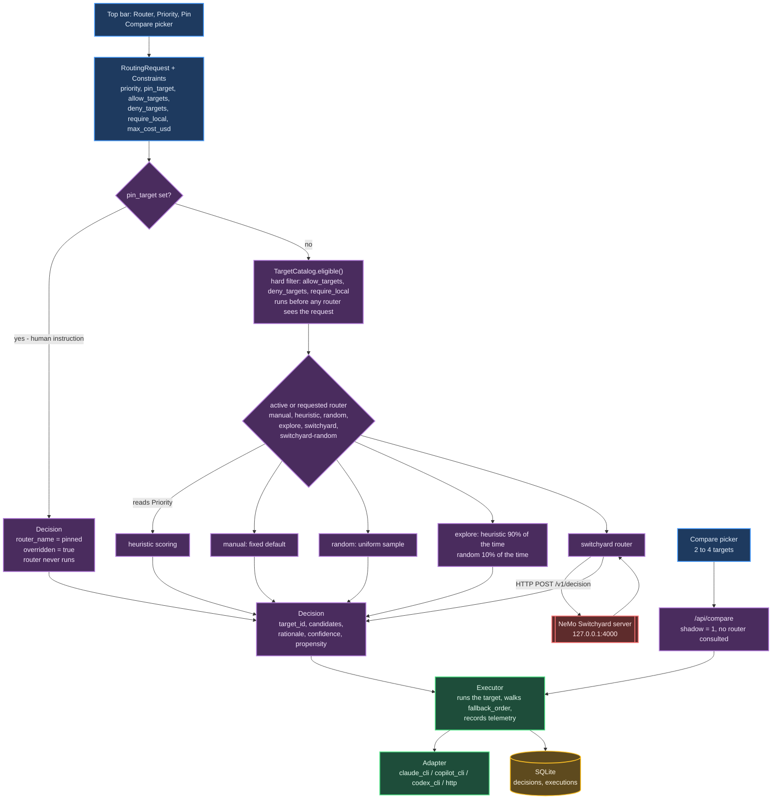
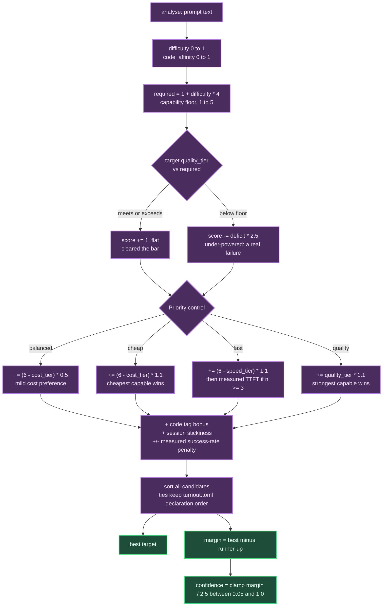

# Controls: What Each UI Control Does to the Routing Decision

The top bar at `http://127.0.0.1:8700` has four controls: **Router**, **Priority**, **Pin**,
and **Compare models**. Each of them is a different way of touching the same object — a
`Decision` — before it reaches the executor. This document explains precisely what each
control changes, in what order, and backs every claim with real output captured from the
running Turnout (`/api/route`, which decides without spending money) plus the actual Python
and Rust source Turnout and Switchyard are built from.

It also covers four fields that exist in the `Constraints` API today but have **no UI control
yet** — `allow_targets`, `deny_targets`, `require_local`, `max_cost_usd` — and states plainly,
from the source, which of them the code actually enforces.

This is not a repeat of `routing.md` or `switchyard.md`; it assumes you may read this first and
links out to them for the parts they already cover in depth: the full heuristic scoring
algorithm, the `/v1/decision` wire contract, and the database schema. Where this document and
those disagree with what the code actually does on this machine, this document says so — the
last section is a running list of what I found to be wrong or incomplete when I checked.

## Where a Control Sits in the Pipeline

Every request goes through the same three stages, in the same order, regardless of which
control you touched: **constraints filter the candidate set, then a router picks from what's
left, then the executor runs the pick.** A router never sees a target that a hard constraint
already removed, and a human pin skips the router stage entirely.



Two design choices explain the shape of this diagram, and both are deliberate:

- **Constraints are applied before any router runs.** `TargetCatalog.eligible(constraints)`
  (`turnout/domain.py`) filters `allow_targets`, `deny_targets`, and `require_local`
  and hands the survivors to whichever router is active. A routing *policy* — heuristic,
  random, Switchyard — never gets the chance to reach past a hard limit, because it never sees
  the targets that limit removed.
- **A pin bypasses the router, not the pipeline.** `pin_target` is a human instruction, not a
  policy input, so the routing handler (`turnout/app.py`) intercepts it before any
  router is even looked up. The returned `Decision` has `router_name = "pinned"` and
  `overridden = True`. This holds for every router, including the exploration ones — spending
  an exploration step overriding a human's explicit choice would be both rude and useless as
  training data (see `routers/explore.py`). A pin still has to clear the same request's own
  hard limits, though — see
  [Pin is validated against the target and the request's own constraints](#pin-is-validated-against-the-target-and-the-requests-own-constraints)
  below.

## Anatomy of a Decision

Every control ultimately produces one of these. This is the real, unedited JSON Turnout
returned for the prompt below, routed by `heuristic` — it is exactly what the routing
inspector panel in the UI renders.

```
POST /api/route
{"prompt": "Here's the traceback:\n```\nTraceback (most recent call last):\n  File \"app.py\", line 42, in handle\n    conn.commit()\nsqlite3.OperationalError: database is locked\n```\nWhy is this failing intermittently? Help me find the root cause of this regression.",
 "routers": ["heuristic"]}
```

```json
{
  "decision_id": "dec_13ddb5eae3cf401f",
  "request_id": "req_008fad7b4158434e",
  "target_id": "claude-sonnet",
  "router_name": "heuristic",
  "router_version": "1",
  "rationale": "difficulty 0.58, code affinity 0.90 -> `claude-sonnet` (score +3.85, margin +0.00). Signals: +hard: debugging wording (x2); +code: fenced code block; +code: file extension; +code: error output",
  "candidates": [
    {"target_id": "claude-sonnet",  "score": 3.85, "reasons": ["meets the bar: tier 4 >= required 3.3", "balanced: prefer cheaper among capable (cost tier 3)", "tagged for code, and the prompt looks code-related"]},
    {"target_id": "copilot-sonnet", "score": 3.85, "reasons": ["meets the bar: tier 4 >= required 3.3", "balanced: prefer cheaper among capable (cost tier 3)", "tagged for code, and the prompt looks code-related"]},
    {"target_id": "copilot-gpt-sol","score": 3.85, "reasons": ["meets the bar: tier 4 >= required 3.3", "balanced: prefer cheaper among capable (cost tier 3)", "tagged for code, and the prompt looks code-related"]},
    {"target_id": "copilot-gpt-54", "score": 3.85, "reasons": ["meets the bar: tier 4 >= required 3.3", "balanced: prefer cheaper among capable (cost tier 3)", "tagged for code, and the prompt looks code-related"]},
    {"target_id": "copilot-grok",   "score": 3.85, "reasons": ["meets the bar: tier 4 >= required 3.3", "balanced: prefer cheaper among capable (cost tier 3)", "tagged for code, and the prompt looks code-related"]},
    {"target_id": "codex-default",  "score": 3.85, "reasons": ["meets the bar: tier 4 >= required 3.3", "balanced: prefer cheaper among capable (cost tier 3)", "tagged for code, and the prompt looks code-related"]},
    {"target_id": "codex-sol",      "score": 3.35, "reasons": ["meets the bar: tier 5 >= required 3.3", "balanced: prefer cheaper among capable (cost tier 4)", "tagged for code, and the prompt looks code-related"]},
    {"target_id": "codex-terra",    "score": 3.35, "reasons": ["meets the bar: tier 4 >= required 3.3", "balanced: prefer cheaper among capable (cost tier 4)", "tagged for code, and the prompt looks code-related"]},
    {"target_id": "claude-opus",    "score": 2.85, "reasons": ["meets the bar: tier 5 >= required 3.3", "balanced: prefer cheaper among capable (cost tier 5)", "tagged for code, and the prompt looks code-related"]},
    {"target_id": "copilot-opus",   "score": 2.85, "reasons": ["meets the bar: tier 5 >= required 3.3", "balanced: prefer cheaper among capable (cost tier 5)", "tagged for code, and the prompt looks code-related"]},
    {"target_id": "copilot-auto",   "score": 2.55, "reasons": ["under the bar: tier 3 vs required 3.3", "balanced: prefer cheaper among capable (cost tier 2)", "tagged for code, and the prompt looks code-related"]},
    {"target_id": "copilot-gemini", "score": 1.70, "reasons": ["under the bar: tier 3 vs required 3.3", "balanced: prefer cheaper among capable (cost tier 1)"]},
    {"target_id": "claude-haiku",   "score": -0.80,"reasons": ["under the bar: tier 2 vs required 3.3", "balanced: prefer cheaper among capable (cost tier 1)"]}
  ],
  "fallback_order": ["copilot-sonnet", "copilot-gpt-sol", "copilot-gpt-54", "copilot-grok",
                      "codex-default", "codex-sol", "codex-terra", "claude-opus",
                      "copilot-opus", "copilot-auto", "copilot-gemini", "claude-haiku"],
  "confidence": 0.05,
  "latency_ms": 0,
  "eligible_ids": ["claude-haiku", "claude-sonnet", "claude-opus", "copilot-auto",
                    "copilot-sonnet", "copilot-opus", "copilot-gpt-sol", "copilot-gpt-54",
                    "copilot-grok", "copilot-gemini", "codex-default", "codex-sol", "codex-terra"],
  "constraints_applied": [],
  "raw": {"difficulty": 0.58, "code_affinity": 0.90,
          "signals": ["+hard: debugging wording (x2)", "+code: fenced code block",
                       "+code: file extension", "+code: error output"]},
  "overridden": false,
  "propensity": 1.0,
  "explored": false
}
```

| Field | What it is | Which control affects it |
|---|---|---|
| `decision_id` | Fresh unique ID for this decision | none — always generated |
| `request_id` | Ties the decision back to its `RoutingRequest` | none |
| `target_id` | **The target that actually gets called.** Everything else on this page exists to explain this one field. | Router, or Pin (overrides it) |
| `router_name` | Which router produced this — `manual`, `heuristic`, `random`, `eps0.1-heuristic` (the registered name is `explore`; see [below](#a-router-can-rename-itself-in-the-decision) for why the reported name differs), `switchyard`, `switchyard-random`, `pinned`, or `compare` | Router / Pin / Compare |
| `router_version` | The router's version string | Router |
| `rationale` | One human-readable sentence explaining the pick | Router |
| `candidates` | Every eligible target, scored and ranked, each with the named reasons that produced its score | Router (Priority changes the scores; see below) |
| `fallback_order` | What the executor tries next, in order, if `target_id` fails. Empty for a pinned or compared decision — see [Pin](#pin) | Router |
| `confidence` | Normalized margin over the runner-up (heuristic); `1.0` for a fully deterministic pick (manual, pinned); `None` where the router genuinely has no such number (`switchyard`, an exploration draw) | Router |
| `latency_ms` | How long *deciding* took — not execution. For `switchyard`'s classifier route this includes a real model call and can be ~20 seconds; see [below](#switchyard--switchyard-random) | Router |
| `eligible_ids` | What survived `TargetCatalog.eligible()` for this request's constraints | allow_targets / deny_targets / require_local |
| `constraints_applied` | Transparency log of which non-default hard constraints (plus a non-`balanced` priority, plus a declared-but-unenforced `max_cost_usd`) were in play. **Always empty for a pinned decision** — even though a pin is now validated against these same fields before it's honoured; see [Pin](#pin) | Priority / allow_targets / deny_targets / require_local / max_cost_usd |
| `raw` | Router-specific payload: the heuristic's `difficulty`/`code_affinity`/`signals`, or Switchyard's entire `/v1/decision` response body. `None` for manual, random, pinned, compare | Router |
| `overridden` | `true` only for a pin or a compare run | Pin / Compare |
| `propensity` | P(this target chosen \| router state) — `1.0` for a deterministic router, the real sampling fraction for `random`/`explore`. **Deliberately `None` for `switchyard-random`** — see [below](#switchyard-random-still-never-records-a-propensity) | Router |
| `explored` | `true` only when `explore` actually took its random branch (not this example — see the router matrix below) | Router |

With that vocabulary in hand, here is what each control does.

## Router

Six options, each a different implementation of the same `Router` protocol
(`turnout/domain.py`) — pure decision logic with no credentials, no subprocesses,
no retries (`turnout/routers/base.py`). Selecting one in the top bar calls
`POST /api/router {"name": ...}`, which sets the active router for every subsequent
request until changed again — nothing restarts.

| Router | UI tooltip text | What it actually does |
|---|---|---|
| `manual` | *Fixed default target; the control condition.* | Always returns `cfg.default_target` (`claude-haiku`). No prompt inspection at all. |
| `heuristic` | *Transparent scored rules — the everyday router.* | Scores every eligible target on a capability floor, then cost/speed/quality per Priority. Full detail: `routing.md`. |
| `random` | *Uniform random. Pure exploration; produces unbiased training data.* | Uniform sample over the eligible set; records the true `propensity` (`1/n`). |
| `explore` | *Heuristic 90% of the time, random 10% — everyday policy that still explores.* | `EpsilonGreedyRouter(heuristic, epsilon=0.1)`. Registered as `explore`; see the naming note below. |
| `switchyard` | *NVIDIA NeMo Switchyard's /v1/decision.* | Calls Switchyard's `switchyard/classifier` route: a cheap model judges the task, then routes to a strong or weak target. |
| `switchyard-random` | *Switchyard configured for a randomized decision route — exploration through the same backend.* | Calls Switchyard's `switchyard/random` route: uniform over every target, no model call. |

### Real matrix: six prompts, all six routers

Captured live from `/api/route`, one request per prompt with `"routers"` listing all six
(each router runs against the exact same `RoutingRequest`, so this is a fair comparison):

| Prompt (chars) | manual | heuristic | random | explore | switchyard | switchyard-random |
|---|---|---|---|---|---|---|
| `hi` (2) | claude-haiku | claude-haiku | codex-terra | claude-haiku | codex-sol | codex-default |
| `What's the capital of France?` (29) | claude-haiku | claude-haiku | copilot-gemini | claude-haiku | codex-sol | copilot-gpt-sol |
| `Write a function that reverses a string in Python.` (50) | claude-haiku | claude-haiku | copilot-gpt-sol | claude-haiku | codex-sol | copilot-gpt-54 |
| Traceback + "why is this failing... root cause of this regression" (247) | claude-haiku | **claude-sonnet** | copilot-grok | **claude-sonnet** | codex-sol | copilot-grok |
| `Prove P != NP.` (14) | claude-haiku | **copilot-gemini** | codex-terra | **copilot-gemini** | codex-sol | claude-haiku |
| Auth-architecture redesign, security trade-offs, phased rollout (1,701) | claude-haiku | **codex-sol** | claude-opus | **codex-sol** | codex-sol | claude-opus |

What this table actually shows:

- **`manual` never moves.** That's the point of a control condition.
- **`heuristic` and `explore` agree on every row here** — not a coincidence to worry about,
  just what `epsilon=0.1` predicts: each of these six calls reported
  `"explored": false, "propensity": 0.9077`. `0.9 + 0.1/13 = 0.9077` exactly — the greedy
  branch fired all six times. Over enough calls, about 1 in 10 would show `"explored": true`
  and a different target.
- **`random` picks something different almost every row**, including targets `heuristic`
  never touches in this sample (`codex-terra`, `copilot-grok`) — this is exactly the coverage
  problem `random` exists to solve. A router trained only on `heuristic`'s and `manual`'s
  history would never see a single example of `codex-terra` handling anything.
- **`switchyard` picked `codex-sol` (the configured strong target) for every single prompt
  tested here, including `hi`.** Turnout cannot see why — Switchyard's classifier is a
  real model call behind an opaque judgment, which is exactly why `confidence` is reported as
  `None` for this router (see below). Do not read "always picks the strong model" as a general
  property of the classifier route from six calls; it's what happened on this run.
- **`heuristic` tracks difficulty visibly**: the debugging prompt escalates to `claude-sonnet`,
  the long architecture prompt escalates further to `codex-sol`, and — the interesting row —
  `Prove P != NP.` escalates too, just not as far. See the next point.

### Brevity is not easiness when a hard signal fires

`Prove P != NP.` is 14 characters — well under the router's 80-character "very short prompt"
threshold that normally *lowers* difficulty by 0.15. It doesn't get that discount here, because
`HeuristicRouter.analyse()` only applies it `elif n_chars < 80 and not hard_hits` — and `prove`
matches the analytical-wording hard pattern first. The real recorded signal:

```json
{"difficulty": 0.44, "code_affinity": 0.0, "signals": ["+hard: analytical wording"]}
```

`required = 1 + 0.44*4 = 2.8`. That excludes `claude-haiku` (quality tier 2) but *not*
`copilot-gemini` (quality tier 3) — the floor this prompt clears is modest, so a cheap model
that clears it still wins on cost. "Not easy" moved the bar; it didn't hand the job to the most
expensive model on the roster.

### A router can rename itself in the decision

The registry key you select in the UI (`explore`) is not always what shows up in
`decision.router_name`. `EpsilonGreedyRouter.__init__` sets
`self.name = f"eps{epsilon:g}-{inner.name}"`, so every decision it produces is stamped
`eps0.1-heuristic` — deliberately, so a decision log tells you the exact epsilon and inner
policy without cross-referencing the config. `SwitchyardRouter` follows the same pattern now,
too — both exist so a decision's own `router_name` field is enough to know exactly which policy
produced it, with no config lookup required. That wasn't always true for `SwitchyardRouter`; see
below.

### switchyard / switchyard-random

Two Turnout routers, one Python class (`SwitchyardRouter`,
`turnout/routers/switchyard.py`), differing only in which route id they call. Two
things about it were always deliberate design choices; testing turned up one more mechanism
worth knowing precisely (how the "once per session" cache actually works), one bug that has
since been fixed, and one apparent gap that turns out to be deliberate restraint rather than an
oversight once you think through what value could honestly go there.

**Deliberate: `confidence` is always `None`.**
`SwitchyardRouter.decide()` sets `confidence=None` explicitly, with the comment "Switchyard
does not expose a score or margin, so claiming a calibrated confidence here would be an
invention." Confirmed on a real classifier decision:

```json
{"target_id": "codex-sol", "confidence": null, "propensity": null, "latency_ms": 19731}
```

**Deliberate: the classifier route's ~20-second cost is real and happens once per session,
not per turn.** Measured directly, same session id, two calls:

```
turn 1 (new session, "hi"):                                     0.01s -> codex-sol   (cache hit, see below)
turn 2 (same session, a much harder follow-up prompt):          26.99s -> claude-haiku (fresh classification)
```

Switchyard's own decision overhead — everything except the classifier's model call — is
consistently a few milliseconds: the instant `switchyard-random` route measured
`"latency_ms": 5` on a real call. The ~20-second figure documented in `turnout.toml` is
entirely the classifier's judgment call, a real model invocation that happens to run through
Turnout's own CLI providers (see `switchyard_config.py`'s loop-back design, covered in
`switchyard.md`).

**A finding, not a design choice — the "once per session" cache is keyed on message content,
not on Turnout's session id.** `switchyard.py` sends Turnout's session id in the
OpenAI-style `"user"` field of the request body, with the comment "Switchyard keys session
affinity off the conversation itself; passing our session id through `user` keeps its notion of
a session aligned with Turnout's." I checked this against the Switchyard v0.2.0 source
(`https://github.com/NVIDIA-NeMo/Switchyard/blob/main/crates/switchyard-server/src/lib.rs`, `https://github.com/NVIDIA-NeMo/Switchyard/blob/main/crates/libsy/src/algorithms/util/affinity.rs`):
the `/v1/decision` endpoint builds its session metadata with `Metadata::from_headers(&headers)`
— from HTTP **headers**, not from the JSON body. Turnout never sends a session header, only
the body field. With no header present and `message_hash_fallback = true` configured on the
classifier route, `AffinityRouter` falls back to hashing the **first user message's text** as
the cache key (`first_user_message_hash`, in `affinity.rs`).

I reproduced this directly: two calls with two different fresh session ids, both opening with
the exact text `"hi"`, returned the identical cached target (`codex-sol`) with `latency_ms: 5`
on the second one — no classifier call ran. In an ordinary growing conversation this is
harmless, because the first user message is stable for the life of that conversation, so the
practical effect really is "classify once per conversation." But it is not scoped *by*
conversation — it is scoped by whatever the first message says. Two unrelated users (or two
unrelated sessions in Turnout) who both open with `"hi"` will silently share one cached
classification.

**Fixed since this was first written — `switchyard` and `switchyard-random` used to report the
same `router_name`.** `SwitchyardRouter.name = "switchyard"` was a class attribute, set once,
never overridden per instance, so both registry entries reported `router_name: "switchyard"`
regardless of which route they actually called. `SwitchyardRouter.__init__` now takes a `name`
parameter and sets it per-instance, and `registry.py` passes the registry key through when it
builds each one:

```python
for router_name, route_id in cfg.switchyard.routes.items():
    routers[router_name] = SwitchyardRouter(
        base_url=cfg.switchyard.url, route=route_id,
        fallback_target=cfg.default_target, name=router_name,
    )
```

Verified live, one call naming both:

```
$ curl -sS -X POST http://127.0.0.1:8700/api/route \
    -d '{"prompt":"hi","routers":["switchyard","switchyard-random"]}'
{"router_name": "switchyard",        "target_id": "codex-sol"}
{"router_name": "switchyard-random", "target_id": "claude-opus"}
```

Each now reports its own name in every `Decision` it produces, so the `decisions.router_name`
column in SQLite — and therefore `/api/stats`' `routing_mix` and the per-router success-rate/cost
aggregates — no longer merge the two routes' history. Regression test:
`test_each_switchyard_route_gets_its_own_router_name` in `tests/test_routing.py`.

### switchyard-random still never records a propensity

`_decision()`'s `propensity` parameter defaults to `None`, and `SwitchyardRouter.decide()` never
passes a value for it — confirmed above (`"propensity": null` on both routes). Unlike the
`router_name` collision, this one is staying, deliberately: an external router that does not
report its own selection probability should not have one invented for it. `switchyard-random`
*is* genuinely uniform random (`p = 1/13` for each of the 13 targets here), and it would be easy
to just compute `1/len(eligible)` the way Turnout's own `RandomRouter` does — but that would
be a guess about Switchyard's internal sampling, not a measurement of it, and a wrong propensity
is worse than a missing one: it would silently corrupt any off-policy estimate built from it
later, while `None` at least says plainly "don't use this row that way." Practical consequence:
if you want exploration data you can later correct for, use Turnout's own `random` or
`explore` routers — they compute and record the real value. `switchyard-random` is still useful
as an everyday exploration *policy* (it genuinely tries every target); it just isn't the source
to reach for when the point of the exercise is producing data a learned router can be corrected
against.

## Priority

Four options: `balanced`, `cheap`, `fast`, `quality` — the `Priority` enum in `domain.py`. This
is a **soft preference**: `Constraints.priority` is not a filter, so it never removes a target
from `eligible_ids`. Only one router actually reads it.

- **`heuristic` reads it directly** in `HeuristicRouter.score()` — see the branch below.
- **`explore`'s greedy branch reads it too**, because it wraps `heuristic`; its random branch
  (10% of decisions) ignores it, same as plain uniform sampling always does.
- **`manual`, `random`, and `switchyard`/`switchyard-random` never look at it.** `ManualRouter`
  and `RandomRouter` don't reference `req.constraints.priority` anywhere in their source.
  `SwitchyardRouter.decide()` builds its `/v1/decision` payload from only `model`, `messages`,
  and `user` — Priority is not in that payload, so changing it while `switchyard` is your active
  router changes nothing about what Switchyard chooses. (It is still logged in
  `constraints_applied` on the returned `Decision` whenever it's non-`balanced`, so the record
  shows what you *asked* for even where the router didn't act on it.)

### How Priority changes the heuristic's score

Every target first clears or fails the same capability floor, independent of Priority. Only
after that does Priority decide *how* the remaining points get assigned:



Note the last box in `RANK`: Python's `sorted()` is stable, and the code sorts descending by
score alone with no tiebreaker. Ties therefore resolve by the order targets appear in
`ctx.catalog.eligible(...)`, which follows `turnout.toml`'s `[[targets]]` declaration order.
This is visible in the full `Decision` JSON above: six targets tie at `3.85`, and
`claude-sonnet` wins — not because it's special, but because it's declared earlier in
`turnout.toml` than `copilot-sonnet`, `copilot-gpt-sol`, and the other tied entries.

### Real matrix: one prompt, four priorities

Same debugging prompt as the `Decision` example above, `heuristic` router, one fresh session
per call so session stickiness can't contaminate the comparison. Top four candidates shown for
each:

**`balanced`** → `claude-sonnet` (confidence 0.05)
```
claude-sonnet    +3.85  meets the bar: tier 4 >= required 3.3; balanced: prefer cheaper among capable (cost tier 3); tagged for code
copilot-sonnet   +3.85  (same — tied)
copilot-gpt-sol  +3.85  (same — tied)
copilot-gpt-54   +3.85  (same — tied)
```

**`cheap`** → `claude-sonnet` (confidence 0.05) — same winner, larger gap from the cost term
(`1.1` weight instead of `0.5`), same four-way tie broken the same way:
```
claude-sonnet    +5.65  meets the bar: tier 4 >= required 3.3; cheap priority: cost tier 3; tagged for code
copilot-sonnet   +5.65  (tied)
```

**`fast`** → `copilot-grok` (confidence 0.273) — a *different* winner, and the reason is not the
static `speed_tier` (copilot-grok and claude-sonnet both declare `speed_tier = 2`). It's
measured history overriding the configured tier:
```
copilot-grok     +7.43  meets the bar: tier 4 >= required 3.3; fast priority: speed tier 2; tagged for code; measured time-to-first-token 3273ms
claude-sonnet    +6.75  meets the bar: tier 4 >= required 3.3; fast priority: speed tier 2; tagged for code
```
`copilot-grok` has 3 recorded executions in Turnout's database (`n >= 3`, the router's
threshold for trusting measured data over the configured guess), with a real average
time-to-first-token of 3273ms feeding the bonus `max(-1.5, 1.5 - ttft/4000) = +0.68`.
`claude-sonnet` only has 2 recorded executions, below the threshold, so it gets no such bonus
and loses a tie it would otherwise have kept.

**`quality`** → `claude-opus` (confidence 0.05):
```
claude-opus      +7.85  meets the bar: tier 5 >= required 3.3; quality priority: tier 5; tagged for code
copilot-opus     +7.85  (tied)
codex-sol        +7.85  (tied)
```

### Measured history overriding a configured tier — the general case

The rationale bullets for this project name a specific example: `copilot-gemini` is configured
`speed_tier = 1` (the fastest tier) but should measure slower than `claude-haiku`, also tier 1,
because the Copilot CLI carries a larger fixed startup cost per call than the Claude CLI. The
Turnout's own `/api/stats` confirms it, from this machine's real execution history:

| target | n (executions) | measured avg time-to-first-token |
|---|---|---|
| `claude-haiku` | 25 | **1,624 ms** |
| `copilot-gemini` | 6 | **3,937 ms** |
| `copilot-grok` | 3 | 3,273 ms |
| `copilot-sonnet` | 1 (below threshold, not yet trusted) | 3,073 ms |

Both `claude-haiku` and `copilot-gemini` declare the same `speed_tier = 1` in `turnout.toml`.
Once each has three or more recorded calls, the heuristic stops trusting that tier equally for
both and starts trusting the measured number instead — which is exactly what the `fast`-priority
example above shows happening to `copilot-grok` and `claude-sonnet`.

## Pin

"Auto (router decides)" plus one entry per target in the catalog — all 15 of them (13 enabled,
plus `grok-4` and `ollama-local`, both disabled in `turnout.toml` and shown greyed out with an
"— unavailable" suffix), grouped by adapter (`renderPinSelect()`,
`turnout/static/app.js`). Picking one sets `S.pinTarget` in the UI's in-memory state
and sends `constraints.pin_target` on the next request; picking "Auto" clears it.

### What happens in code

`Turnout.decide()` checks `req.constraints.pin_target` **before** looking up any router, and now
validates it against three things before honouring it — whether the target is `enabled`,
whether its adapter actually probed as reachable, and whether the target survives this same
request's own `allow_targets`/`deny_targets`/`require_local`:

```python
async def decide(self, req: RoutingRequest, router_name: str | None = None) -> Decision:
    if req.constraints.pin_target:
        pin = req.constraints.pin_target
        target = self.catalog.get(pin)
        if target is None:
            raise HTTPException(400, f"unknown target '{pin}'")
        # A pin outranks a router, but it does not outrank reality or the
        # request's own limits. Silently honouring a pin that the same
        # request excluded -- or one whose provider is not even reachable --
        # produces a decision that cannot be executed and a fallback chain
        # of length zero. Refuse it and say which rule it broke.
        if not target.enabled:
            raise HTTPException(400, f"target '{pin}' is disabled in the config")
        if target.available is False:
            detail = self.probe_results.get(target.adapter, (False, "unavailable"))[1]
            raise HTTPException(400, f"target '{pin}' is not reachable: {detail}")
        if pin not in {t.id for t in self.catalog.eligible(req.constraints)}:
            raise HTTPException(
                400,
                f"target '{pin}' is pinned but excluded by this request's own "
                f"constraints (deny_targets / allow_targets / require_local)",
            )
        return Decision(
            decision_id=new_id("dec"), request_id=req.request_id,
            target_id=target.id, router_name="pinned", router_version="1",
            rationale=f"Pinned by the user to `{target.id}`; no router consulted.",
            candidates=[Candidate(target.id, 1.0, ["pinned by user"])],
            eligible_ids=[t.id for t in self.catalog.eligible(req.constraints)],
            confidence=1.0, overridden=True,
        )
    name = router_name or self.active_router
    ...  # router lookup and .decide() call happen only past this point
```

A pin that clears all three checks still produces the same minimal `Decision` as before:
`confidence = 1.0`, `overridden = True`, a single `candidates` entry, and — because this branch
never calls the shared `_decision()` helper that every real router uses — an **empty
`fallback_order`** and an **empty `constraints_applied`**, even when other constraints were set
on the same request. If a *validated* pinned target's execution still fails at run time (a live
outage after the probe, say), there is nothing for the executor to fall back to; what changed is
that a pin can no longer *reach* execution while already known to be disabled, unreachable, or
self-contradictory with the rest of the request — that now fails the request up front instead.

Verified: pinning to `claude-opus` (enabled, reachable, not excluded by anything) while asking
for `random`, `heuristic`, and `switchyard` in the same call returns the identical `pinned`
decision three times, instantly (no 20-second Switchyard wait, because Switchyard is never
called):

```json
[
  {"router_name": "pinned", "target_id": "claude-opus", "overridden": true},
  {"router_name": "pinned", "target_id": "claude-opus", "overridden": true},
  {"router_name": "pinned", "target_id": "claude-opus", "overridden": true}
]
```

### Pin is validated against the target and the request's own constraints

The design intent stated at the top of this document — hard constraints filter the candidate
set before any policy runs — used to hold for every *router* but not for the pin path itself:
`self.catalog.get(pin_target)` looked a target up by id with no check against `enabled`,
`available`, `deny_targets`, `allow_targets`, or `require_local` from the very same request. That
gap is closed. `Turnout.decide()` now returns HTTP 400, naming exactly which rule it broke, if
any of those checks fail.

**Pinning a target disabled in `turnout.toml`:**
```
$ curl -X POST /api/route -d '{"prompt":"hi","routers":["heuristic"],
    "constraints":{"pin_target":"grok-4"}}'

HTTP 400
{"detail": "target 'grok-4' is disabled in the config"}
```

**Pinning a target that the same request also denies:**
```
$ curl -X POST /api/route -d '{"prompt":"hi","routers":["heuristic"],
    "constraints":{"pin_target":"claude-opus","deny_targets":["claude-opus"]}}'

HTTP 400
{"detail": "target 'claude-opus' is pinned but excluded by this request's own constraints
            (deny_targets / allow_targets / require_local)"}
```

**A legitimate pin still works exactly as before:**
```
$ curl -X POST /api/route -d '{"prompt":"hi","routers":["heuristic"],
    "constraints":{"pin_target":"claude-opus"}}'

HTTP 200
{"target_id": "claude-opus", "router_name": "pinned", "overridden": true,
 "fallback_order": [], "constraints_applied": []}
```

One more fix rides along with this one. `POST /api/route` used to catch every exception a router
(or the pin check) raised and file it as a per-row `{"router_name": ..., "error": ...}` entry
while still returning HTTP 200 overall — so a rejected pin looked, to a client, like one router
quietly failing rather than like the request itself being invalid. It now re-raises
`HTTPException` (a bad pin, an unknown router, an unknown target) so the whole call fails; an
ordinary router-level failure — say, `heuristic` raising "no eligible targets" because
`require_local` emptied the catalog — is still filed per-row with an overall 200, because one
router being broken must not hide what the others returned. Verified: requesting
`["random", "heuristic", "switchyard"]` together with a disabled pin fails the entire call with
one `HTTP 400`, not three rows; requesting `["heuristic", "random"]` with `require_local` set
(no pin) still returns `HTTP 200` with two `{"error": "no eligible targets for this request"}`
rows. Five new tests in `tests/test_api.py` cover this distinction.

With this fix, the principle now holds without exception: a pin outranks the router, but not the
request's own limits and not reachability. The UI never let you reach the disabled-target case
anyway (the pin dropdown greys out unavailable targets), but anything else built against this
API — the OpenAI-compatible `/v1/chat/completions`, or your own client — now gets the same
guarantee the UI always implied.

## Compare Models

The "Compare models" toggle opens a picker of 2–4 targets, grouped by adapter. Sending a prompt
in compare mode calls `POST /api/compare` instead of `/api/chat`, which runs the same prompt
against every picked target concurrently and streams each column back independently.

Each target's run gets its own `Decision`, built inline in the compare handler rather than by
any router:

```python
d = Decision(
    decision_id=new_id("dec"), request_id=req.request_id, target_id=tid,
    router_name="compare", router_version="1",
    rationale=f"Side-by-side comparison run on `{tid}`.",
    candidates=[Candidate(tid, 1.0, ["comparison"])], overridden=True,
)
```

No router is consulted, no scoring happens, and `overridden=True` — a compare run is not a
routing decision to learn from, it's a controlled experiment. Crucially, `Executor.run(...,
shadow=True, max_fallbacks=0)` marks every resulting row `shadow = 1` in the `executions` table.
`target_stats`, `/api/stats`, and the heuristic's own measured-history lookups all filter on
`shadow = 0` — see `database.md` — so compare runs never pollute the live per-target statistics
that other requests get scored against, no matter how many times you run one.

Clicking "This one won" on a finished column calls `POST /api/preference` with the winning and
losing target ids for that turn, defaulting `judge` to `"human"`. This writes a row to the
`preferences` table — the counterfactual label the project's design docs call out as the one
piece of data a router's own history can never produce by itself (you only ever see what it
*did* choose, never what would have happened if it hadn't). Full schema and the reasoning behind
it: `database.md`, "The Counterfactual Problem."

## Constraints With No UI Control Yet

Four fields exist on `Constraints` today with no corresponding top-bar control. Here is exactly
what the code does with each one, verified by calling `/api/route` with and without it set.

| Field | Enforced? | Evidence |
|---|---|---|
| `allow_targets` | **Yes.** Hard allow-list, applied in `TargetCatalog.eligible()` before any router runs. | `{"allow_targets": ["claude-haiku", "claude-opus"]}` → `eligible_ids: ["claude-haiku", "claude-opus"]`, exactly those two, nothing else. |
| `deny_targets` | **Yes.** Hard deny-list, same filter. | Denying 7 of the 13 enabled targets → `eligible_ids` contains exactly the remaining 6. |
| `require_local` | **Yes.** Same filter, `t.local == True` only. | `{"require_local": true}` → `{"error": "no eligible targets for this request"}`. The only `local = true` target in `turnout.toml` is `ollama-local`, and it's `enabled = false`, so today this constraint always empties the catalog. Set it once you actually enable a local provider. |
| `max_cost_usd` | **No — deliberately, and now said so out loud.** Parsed into `Constraints` by `build_constraints()`, never used to filter `eligible()`, never read by any router or the executor — but `BaseRouter._decision()` now always logs it in `constraints_applied` when it's set. | `{"max_cost_usd": 0.0000001}`: all 13 targets stay eligible and the same target is chosen, but `constraints_applied` now reads `["max_cost_usd=1e-07 (declared, NOT enforced)"]`. |

`allow_targets`, `deny_targets`, and `require_local` show up in `constraints_applied` because
they changed the eligible set. `max_cost_usd` shows up there for a different reason: it changed
nothing, and the code now says so explicitly rather than letting a caller believe a cap is in
force when nothing checks it. The comment added alongside this fix in `routers/base.py` gives the
actual reason it stays unenforced rather than getting a real filter — **only Claude reports real
dollars.** Copilot reports "AI credits," a different unit with no fixed USD conversion, and Codex
reports neither a dollar cost nor credits at all. There is no honest per-request dollar estimate
to compare `max_cost_usd` against across all thirteen targets; inventing one for Copilot and
Codex just to make the filter work would mean silently comparing real dollars to a guess on two
out of three providers, which is worse than not filtering at all. So the field is accepted,
stored for the life of the request, surfaced in every decision that sets it, and otherwise left
alone until there's an honest cross-provider cost signal to filter on.

## The TOML That Drives All of This

### A target block, annotated

```toml
[[targets]]
id = "claude-haiku"           # Primary key everywhere: Pin, allow_targets, deny_targets,
                               # pin_target, the DB's target_id columns, the Switchyard
                               # generated config's `model =` field. Change this and every
                               # reference to the old id breaks.
adapter = "claude_cli"        # Which Adapter implementation the Executor calls. Not read
                               # by any router's scoring logic.
model = "haiku"                # The model string handed to that adapter. Adapter-specific;
                               # opaque to routing.
label = "Claude Haiku 4.5"     # Display only.
cost_tier = 1                  # 1 = cheapest .. 5 = most expensive.
speed_tier = 1                 # 1 = fastest .. 5 = slowest.
quality_tier = 2                # 1 = weakest .. 5 = strongest -- NOTE THE FLIP: unlike cost
                               # and speed, higher quality_tier is better. All three feed
                               # HeuristicRouter.score() directly; only quality_tier runs
                               # the opposite direction from the other two.
tags = ["chat", "fast"]        # Only "code" has any effect on scoring (a +1.5*code_affinity
                               # bonus when it's present and the prompt looks code-related).
                               # Every other tag, including these two, is documentation only.
notes = "Cheap and quick. The right answer for most short prompts."   # UI tooltip text only.
```

(`local` and `enabled`, not present on this particular block because they default to `false`
and `true`, are the two other fields a router-independent filter reads: `local` gates
`require_local`, `enabled` gates every hard-constraint filter and the `check`/probe display.)

`cost_tier`/`speed_tier`/`quality_tier` are, per the comment at the top of `turnout.toml`
itself, *"1-5 estimates used to seed routing before there is real data."* The `fast`-priority
example above is exactly this seed being superseded: once a target has three or more recorded
executions, measured time-to-first-token and success rate start outweighing these three numbers
in `HeuristicRouter.score()`.

### `[switchyard.routes]`: one Turnout router name to one Switchyard route id

```toml
[switchyard.routes]
switchyard        = "switchyard/classifier"
switchyard-random = "switchyard/random"
```

`build_routers()` (`turnout/registry.py`) loops over this table directly:

```python
for router_name, route_id in cfg.switchyard.routes.items():
    routers[router_name] = SwitchyardRouter(
        base_url=cfg.switchyard.url, route=route_id,
        fallback_target=cfg.default_target,
    )
```

Each key becomes a selectable entry in the Router dropdown; each value is the route id
`SwitchyardRouter` sends as the `model` field to `/v1/decision`. Add a third line here — say
`switchyard-cheap = "switchyard/passthrough"` — and a third router appears in the UI with no
other code change. The [worked example below](#worked-example-2-repointing-the-switchyard-router)
does exactly this kind of edit, just by repointing an existing key instead of adding one.

### The four generated routes, quoted from `config/switchyard.generated.toml`

`switchyard_config.py` always generates all four, regardless of which ones `[switchyard.routes]`
actually wires up to a Turnout router. Only `random` and `classifier` are reachable from this
UI today (see `switchyard.md`, "Turnout Registers Two Switchyard Routers, Not One", for the
full story on `passthrough` and `stage`):

```toml
# Uniform random over every target. Useful as an exploration policy:
# it produces the unbiased data a learned router needs.
[routes.random]
id = "switchyard/random"
type = "random"
targets = ["claude_haiku", "claude_sonnet", ...]   # every enabled target, TOML-key-mangled
```
`id` is what a client (or a Turnout router) names to select this route. `targets` is the full
sample space — every enabled target gets an equal chance.

```toml
# Always the Turnout default. The control condition.
[routes.passthrough]
id = "switchyard/passthrough"
type = "passthrough"
target = "claude_haiku"        # cfg.default_target, TOML-key-mangled
```
Switchyard's own version of `manual` — always the same one target, no judgment call, no
latency. This is the route the [route-flip worked example](#worked-example-2-repointing-the-switchyard-router)
below switches `switchyard` to point at.

```toml
# Switchyard's real routing algorithm: a cheap model judges how hard the
# task is, then the request goes to the strong or the weak target.
[routes.classifier]
id = "switchyard/classifier"
type = "llm_classifier"
mode = "capability"
classifier_target = "claude_haiku"   # picked by pick_tiers(): min(speed_tier, cost_tier)
strong_target = "codex_sol"          # picked by pick_tiers(): max quality_tier
weak_target = "claude_haiku"          # picked by pick_tiers(): min quality_tier
base_threshold = 0.5
classify_trigger = "new_session"      # see the message-hash-affinity finding above
message_hash_fallback = true          # the actual mechanism behind "new_session" here
```
This is what the `switchyard` router calls. `pick_tiers()` (`switchyard_config.py`) chooses
`weak`/`strong`/`classifier` purely from the catalog's declared tiers — regenerate this file
(`turnout switchyard write-config`) after editing tiers in `turnout.toml` and these three
targets can change.

```toml
# Start cheap, escalate when the weak model shows signs of stalling.
[routes.stage]
id = "switchyard/stage"
type = "stage_router"
capable_target = "codex_sol"
efficient_target = "claude_haiku"
picker = "efficient_first"
confidence_threshold = 0.5
recent_turn_window = 3
```
Generated, valid, and currently unreachable from this UI — no key in `[switchyard.routes]`
points at `switchyard/stage`. Add one to try it.

## Worked Examples: Real Edits, Real Before/After

Both edits below were made to the live `turnout.toml`, run against the live Turnout (restarted
so the change actually took effect — this config is read once at process startup, not
hot-reloaded), and then **reverted exactly** — confirmed by diffing the file before and after
each edit, which showed only the one line each demonstration touched (`quality_tier` for the
first, the `switchyard` key in `[switchyard.routes]` for the second) — with Turnout restarted
once more afterward to return to a clean state. `config/switchyard.generated.toml` and the
Switchyard server process were never touched by either demonstration. (`turnout.toml` has since
picked up an unrelated change of its own — the `[switchyard] binary` path — made outside this
document's edits; that's expected and doesn't affect either worked example below.)

### Worked example 1: raising a target's `quality_tier`

**Before**, `claude-haiku` at its real configured `quality_tier = 2`, `Prove P != NP.` under
`heuristic`:
```
target: copilot-gemini
rationale: difficulty 0.44, code affinity 0.00 -> `copilot-gemini` (score +3.50, margin +0.50).
```
`required = 2.8`; `claude-haiku` (tier 2) is under the bar and penalized; `copilot-gemini`
(tier 3) clears it and wins on cost.

**Edit:** `quality_tier = 2` → `quality_tier = 4` for `claude-haiku`, Turnout restarted.

**After**, identical prompt, identical router:
```
target: claude-haiku
rationale: difficulty 0.44, code affinity 0.00 -> `claude-haiku` (score +3.50, margin +0.00).
claude-haiku     +3.50  meets the bar: tier 4 >= required 2.8; balanced: prefer cheaper (cost tier 1)
copilot-gemini   +3.50  meets the bar: tier 3 >= required 2.8; balanced: prefer cheaper (cost tier 1)
```
`claude-haiku` now clears the floor too, and the two tie exactly at `3.50` — cost tier is
identical (both `1`). The tie resolves to `claude-haiku` because it's declared earlier in
`turnout.toml`, exactly the tie-break rule from the Priority section above.

**Reverted:** `quality_tier` back to `2`, Turnout restarted. Re-running the identical request
reproduced the original `copilot-gemini` result exactly (same rationale, same margin), confirming
the revert took effect.

### Worked example 2: repointing the `switchyard` router

**Before**, `switchyard = "switchyard/classifier"`, two very different prompts:
```
"hi"                                                    -> codex-sol   (from cache, 5ms)
"Design a fault-tolerant, globally distributed database
 and prove your consistency model is correct."          -> real classification, ~20-27s
```

**Edit:** in `[switchyard.routes]`, `switchyard = "switchyard/classifier"` →
`switchyard = "switchyard/passthrough"`. Turnout restarted; Switchyard server untouched, because
the `passthrough` route already exists in `config/switchyard.generated.toml` — this edit only
changes which existing route Turnout's `switchyard` router name calls.

**After**, the same two prompts:
```
"hi"                                                     -> claude-haiku   latency_ms=5
"Design a fault-tolerant, globally distributed database
 and prove your consistency model is correct."           -> claude-haiku   latency_ms=5
rationale (both): "Switchyard route `switchyard/passthrough` selected `claude-haiku`.
                    Fallback order: none."
```
Both prompts now return instantly and identically — no classifier call, no difficulty
sensitivity, because `passthrough` doesn't have any. This is the entire behavior difference
between two routes in the same generated config, reachable by editing one line in `turnout.toml`
and restarting.

**Reverted:** `[switchyard.routes]` restored to `switchyard/classifier`, Turnout restarted.

## Sharp Edges: What I Found When I Checked the Source

The rationale for this design is sound and the code mostly matches it. Three things flagged here
when this document was first written have since been fixed — described in place above rather
than repeated here:

- `switchyard` and `switchyard-random` now report distinct `router_name`s (see
  [switchyard / switchyard-random](#switchyard--switchyard-random)).
- `max_cost_usd` is now visible in `constraints_applied` whenever it's set, with the reason it
  stays deliberately unenforced stated in the code (see
  [Constraints With No UI Control Yet](#constraints-with-no-ui-control-yet)).
- A pin is now rejected outright — HTTP 400, not a silent 200 — when it names a disabled or
  unreachable target, or one the same request's own `allow_targets`/`deny_targets`/
  `require_local` excludes (see
  [Pin is validated against the target and the request's own constraints](#pin-is-validated-against-the-target-and-the-requests-own-constraints)).

Three findings remain true and worth knowing before you rely on this system:

1. **Heuristic ties break by `turnout.toml` declaration order**, not randomly and not by any
   documented rule — a side effect of Python's stable `sorted()` over an unordered score. Seen
   directly in both the full `Decision` JSON above (a six-way tie won by whichever target is
   declared earliest) and in worked example 1.
2. **`switchyard-random` still records no `propensity` — and that's a documented choice now, not
   a gap.** Its selection is genuinely uniform random, but Switchyard doesn't report a sampling
   probability Turnout could verify, and a guessed `1/n` would silently corrupt any
   off-policy estimate built on it later. Use Turnout's own `random` or `explore` routers
   instead when the point is producing correctable exploration data — see
   [switchyard-random still never records a propensity](#switchyard-random-still-never-records-a-propensity).
3. **The classifier route's "once per session" behavior is real but not session-scoped.** It's
   achieved by Switchyard's message-hash affinity fallback, not by Turnout's `session_id`
   (which the `/v1/decision` endpoint never actually reads — session metadata there comes from
   HTTP headers Turnout doesn't send). In practice this reproduces "once per conversation"
   because a conversation's first message doesn't change; it also means two unrelated sessions
   that happen to open with the same text share a cached classification. See
   [switchyard / switchyard-random](#switchyard--switchyard-random) above for the reproduction
   and the exact source files checked.

The design principle now holds without exception: constraints gate every router *and* every pin,
a pin still skips routing but not the request's own limits or reachability, the heuristic still
uses a floor rather than a symmetric distance, and Switchyard's classifier still costs a real
model call once per conversation in the ordinary case.

## See Also

- `routing.md` — the full heuristic scoring algorithm line by line, the `Decision`/`Constraints`
  data model in depth, and how to write your own router.
- `switchyard.md` — the `/v1/decision` wire contract, the loop-back config trick, and why only
  two of the four generated routes are reachable from this UI by default.
- `architecture.md` — the Router/Adapter/Executor split, the fallback chain, and the two front
  doors (`/api/*` and `/v1/*`).
- `database.md` — the schema behind `target_stats`, the `shadow` column Compare relies on, and
  the counterfactual-preference problem Compare and the exploration routers both exist to solve.
- `adapters.md` — what actually runs once a `target_id` reaches the executor.
