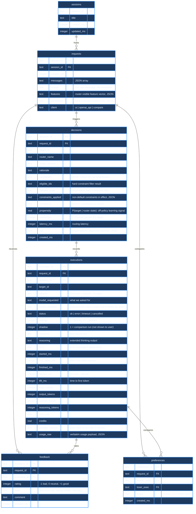

# Switchyard Database Schema

## Design Principle

This schema is shaped for **training a better router later**, not just keeping a chat log. Every routing decision captures what the router *saw* at decision time—the feature vector, the eligible set, the ranked candidates, and the probability assigned to the chosen target. Alongside this, we record what *happened* when that target was executed: latency, cost, success or failure.

This dual recording is essential. Without the router state, you cannot train a model that improves on the current one—you can only teach imitation. The schema treats the router's reasoning as data, not telemetry.

## Schema Diagram



## Tables

### sessions

Container for related requests from one user or conversation thread. Updated when a new request arrives for that session.

```
session_id      TEXT PRIMARY KEY
title           TEXT                -- auto-filled with first request's user message (80 chars)
created_ms      INTEGER NOT NULL
updated_ms      INTEGER NOT NULL    -- bumped on each new request
```

---

### requests

What was asked. One row is written for every request that reaches `Database.record_request()` — currently `/api/chat` (client `ui`), `/api/compare` (client `compare`, one row per comparison, shared by every target in that comparison), and `/v1/chat/completions` (client `openai_api`). `/api/route`, the decide-without-executing preview endpoint, calls a router's `decide()` directly and never persists anything, so not every `decide()` call produces a row here.

The `features` column is the single most important column for training: it captures the deterministic feature vector the router *saw at the time of decision*, not what we compute now. This lets a future model be trained on exactly what its predecessor observed.

```
request_id      TEXT PRIMARY KEY
session_id      TEXT NOT NULL       -- FOREIGN KEY references sessions
created_ms      INTEGER NOT NULL
messages        TEXT NOT NULL       -- JSON [{role, content}, ...]
prompt          TEXT NOT NULL       -- last user message, denormalised for full-text search
features        TEXT NOT NULL       -- JSON dict of router-visible features
constraints     TEXT NOT NULL       -- JSON of hard limits and preferences
client          TEXT DEFAULT 'ui'   -- which interface sent this: 'ui' | 'openai_api' | 'compare'
```

**features** is a JSON dict with these keys (from `RoutingRequest.features()`):

- `n_messages` – count of turns in the conversation
- `n_chars` – total characters in all messages
- `n_chars_last` – length of the last user message
- `est_tokens` – rough token count (chars / 4)
- `has_code_fence` – boolean, true if any message contains ` ``` `
- `n_lines` – newline count + 1
- `n_question_marks` – count of `?` characters
- `is_multi_turn` – boolean, true if more than one user message
- `priority` – string: "balanced" | "cheap" | "fast" | "quality"

These features are cheap to compute once per request and are reused by every router. Storing them lets you retrain on the exact feature set the old router had.

---

### decisions

One row per routing decision. A request gets more than one decision row only through **shadow routing**: the `/api/compare` endpoint creates one decision *per compared target* (all sharing the request's `request_id`, each with `overridden=1`), and one shadow execution per decision, to compare targets side by side without affecting the user's answer.

Retries after failure do **not** create a new decision row: the executor (`executor.py`) walks a single decision's `fallback_order` and writes a new `executions` row per attempt, all pointing back at the same `decision_id`.

The `candidates` and `eligible_ids` columns are the heart of off-policy learning: they record the full ranked set, not just the winner.

```
decision_id             TEXT PRIMARY KEY
request_id              TEXT NOT NULL       -- FOREIGN KEY references requests
target_id               TEXT NOT NULL       -- the chosen target
router_name             TEXT NOT NULL       -- 'heuristic' | 'switchyard' | router name
router_version          TEXT NOT NULL       -- router version string
rationale               TEXT NOT NULL       -- human-readable explanation
candidates              TEXT DEFAULT '[]'   -- JSON [{target_id, score, reasons}, ...]
eligible_ids            TEXT DEFAULT '[]'   -- JSON [target_ids] passing hard constraints
fallback_order          TEXT DEFAULT '[]'   -- JSON [target_ids] in degradation order
constraints_applied     TEXT DEFAULT '[]'   -- JSON [constraint names] non-default for this request
confidence              REAL                -- router confidence in this choice (0-1)
propensity              REAL                -- P(this target | router state, features, context)
overridden              INTEGER DEFAULT 0   -- 1 = human pinned this target via UI
latency_ms              INTEGER DEFAULT 0   -- how long the router took to decide
raw                     TEXT                -- router-specific diagnostic payload, JSON (see below)
created_ms              INTEGER NOT NULL
```

**candidates** is a JSON array of `{target_id, score, reasons}` objects, in descending order by score. Most routers include the chosen target plus every other eligible target; the exception is the epsilon-greedy router's exploration branch (`routers/explore.py`), which logs only the one target it sampled. The score is router-specific (softmax, hand-tuned, a fixed 1.0/0.9/0.8/... ladder, etc.) but is always included so you can compare ranking quality.

**eligible_ids** is the list of target IDs that passed hard constraints, computed by `TargetCatalog.eligible()` (`domain.py`): `allow_targets`, `deny_targets`, and `require_local`. The router must choose from this set; anything outside it is structurally ineligible. Note: `Constraints.max_cost_usd` exists in the API and is parsed from request bodies, but nothing in the current code path reads it — it is accepted and stored, not enforced.

**raw** holds whatever a router wants to keep for debugging, and its shape varies by router: for `SwitchyardRouter` it is the verbatim JSON body Switchyard's `/v1/decision` returned; for `HeuristicRouter` it is `{difficulty, code_affinity, signals}`, its own internal scoring inputs. It is `NULL` for routers that do not set it.

**propensity** is the probability the router had of picking `target_id`, given the request features, context (session history, target stats), and the router's decision logic. This is the **single most important column for learning**: without it, a model trained on this data just learns to imitate the current router. With it, you can use off-policy learning to find a better policy—this target might have been unlikely, but if it turned out great, the new model can increase its propensity.

If a decision comes from an external router service (e.g. Switchyard's `/v1/decision` API), that service must compute and return propensity if you want to use this data for off-policy learning. If propensity is `NULL`, you can still use the data for imitation learning, but not for finding a better policy.

---

### executions

One row per actual provider call. Records what happened when we asked a target to generate a response. Multiple executions per decision are possible:
- **Fallback retries**: if the chosen target errors, the executor may try a fallback target. Each attempt is a new execution row.
- **Shadow executions**: comparison runs for A/B testing (see `shadow` column).

The `attempt` column is not a retry counter—it is set by the executor and indicates position in the chain `[decision.target_id] + decision.fallback_order`. `attempt=1` is always `decision.target_id` itself; `attempt=2` is the first entry of `fallback_order`, `attempt=3` the second, and so on.

```
execution_id     TEXT PRIMARY KEY
request_id       TEXT NOT NULL       -- FOREIGN KEY references requests
decision_id      TEXT                -- FOREIGN KEY references decisions; NULL if no decision (e.g. direct call)
target_id        TEXT NOT NULL
adapter          TEXT NOT NULL       -- 'Anthropic' | 'OpenAI' | 'Google' | 'Groq' | ...
model_requested  TEXT NOT NULL       -- what we asked for: 'haiku', 'gpt-4o', 'auto', ...
model_reported   TEXT                -- what the provider says it used (null if 'auto' hides this)
status           TEXT NOT NULL       -- 'ok' | 'error' | 'timeout' | 'cancelled'
attempt          INTEGER DEFAULT 1   -- 1 = primary, 2+ = fallback position
shadow           INTEGER DEFAULT 0   -- 1 = comparison run, not shown to user
response         TEXT DEFAULT ''     -- the generated text (user-facing answer)
reasoning        TEXT DEFAULT ''     -- extended thinking (Claude) or internal working
error            TEXT                -- error message if status != 'ok'
started_ms       INTEGER NOT NULL    -- when the request was sent
first_token_ms   INTEGER             -- when the first output token arrived
finished_ms      INTEGER NOT NULL    -- when the response completed
latency_ms       INTEGER DEFAULT 0   -- finished_ms - started_ms
ttft_ms          INTEGER             -- first_token_ms - started_ms (time to first token)
input_tokens     INTEGER             -- counted by the provider
output_tokens    INTEGER
cached_tokens    INTEGER             -- prompt caching
reasoning_tokens INTEGER             -- extended thinking tokens (Claude)
cost_usd         REAL                -- what we paid
credits          REAL                -- company internal credits (e.g. Anthropic credits)
provider_session TEXT                -- trace ID at the provider
usage_raw        TEXT                -- verbatim usage JSON from provider
```

**status** is the outcome:
- `ok` – response completed successfully
- `error` – provider returned an error (quota, rate limit, invalid request, etc.)
- `timeout` – request exceeded the time limit
- `cancelled` – user cancelled the request

**attempt** is the position in the fallback order, not a retry counter. If the primary choice (`attempt=1`) times out, the executor walks `fallback_order` and tries the next target as `attempt=2`. Both executions are recorded; this lets you measure whether fallback targets are reliable and compare their latency and cost.

**shadow** is 1 for comparison runs (`/api/compare` runs two or more targets in parallel to let the user pick). These executions do not affect live stats and are excluded from success-rate aggregations. You can use them to train a preference model.

**model_reported** is what the provider told us it used. For Anthropic's non-deterministic routing (the `auto` model), this field is `NULL`. For deterministic requests, it echoes what you asked for (good for audits).

---

### feedback

Human or automated judgement on a request or execution. Supervision signal for training.

```
feedback_id  TEXT PRIMARY KEY
request_id   TEXT NOT NULL       -- FOREIGN KEY references requests
execution_id TEXT                -- FOREIGN KEY references executions; NULL if feedback on whole request
rating       INTEGER             -- -1 bad, 0 neutral, +1 good
label        TEXT                -- free-form tag, e.g. 'wrong-model', 'too-slow', 'hallucinates'
comment      TEXT                -- human comment
created_ms   INTEGER NOT NULL
```

Feedback can be attached to a whole request (rate the quality of the conversation) or to a specific execution (rate that provider's response). Multiple ratings per request are allowed; you might have one feedback saying "overall this was good" and another saying "the JSON extraction was wrong."

---

### preferences

Pairwise comparison: execution A was better than execution B for the same request.

This is the counterfactual signal. See "The Counterfactual Problem" below.

```
preference_id TEXT PRIMARY KEY
request_id    TEXT NOT NULL       -- FOREIGN KEY references requests
winner_exec   TEXT NOT NULL       -- the preferred execution
loser_exec    TEXT NOT NULL       -- the alternative execution
judge         TEXT DEFAULT 'human' -- 'human' or router/model name if auto-generated
created_ms    INTEGER NOT NULL
```

Both executions are for the same request but different targets. This preference row says "when we asked the same question, execution A's response was better than execution B's response."

This is generated by two mechanisms:
1. **Human judgement via `/api/compare`**: user picks the better response.
2. **Exploration**: if the `random` or `explore` router picks a target at random on some requests, and you later judge one outcome better than another, that's a preference (see "Exploring Routers" below).

---

### target_stats (view)

Aggregated rolling measurements per target, computed from non-shadow executions. Routers may condition on this context when making decisions.

```
target_id                TEXT
n                        INTEGER     -- total execution count
n_ok                     INTEGER     -- successful executions
success_rate             REAL        -- n_ok / n
avg_latency_ms           REAL
avg_ttft_ms              REAL
total_cost_usd           REAL
total_credits            REAL
total_output_tokens      INTEGER
```

This is a materialized view over the `executions` table, filtered to `shadow=0`. Routers can use this to prefer faster or cheaper targets as conditions change.

---

## The Counterfactual Problem

**The problem**: if you log only the chosen model and later train on that data, you teach imitation, not improvement. Your new model learns to mimic the old one, not to beat it.

Example: the heuristic router always picks cheap models, and cheap models are faster than expensive ones on short requests. If you train a supervised model on "when the request is short, pick cheap," the model will learn that rule. But you never saw what the expensive model would have done on short requests, so you don't know whether it would have been better. You only know what the router chose, not whether it chose well.

**The schema's two solutions**:

### 1. Side-by-Side Comparison: `/api/compare`

The `/api/compare` endpoint routes the request to multiple targets in parallel, records all executions with `shadow=1` (every one of them, not just the losers — none affect `target_stats`), and lets the human user pick which response is better.

Results in:
- One `decisions` row per compared target (same `request_id`, each `overridden=1`), and one `executions` row per decision, each tied back to its own `decision_id`.
- One `preference` row, if the user picks a winner, linking the chosen execution as `winner_exec` to an unchosen one as `loser_exec`.

This directly teaches "when the request has property X, Y is better than Z." But it only works for requests the user chooses to compare.

### 2. Exploring Routers: `random` and `explore`

Turnout ships two routers built for this, in `routers/explore.py`:
- **`random`** (`RandomRouter`) samples uniformly from the eligible targets. `propensity = 1 / len(eligible)`, and every eligible target appears in `candidates` (the sampled one at score `1.0`, the rest at `0.0`).
- **`explore`** (`EpsilonGreedyRouter`, wrapping `heuristic` at `epsilon=0.1`) follows the heuristic router 90% of the time and samples uniformly the other 10%, so the data stays usable day-to-day while still producing real exploration. Its `propensity` accounts for both paths: `(1 - epsilon) + epsilon/n` when the greedy branch happens to match what the random branch could also have picked, `epsilon/n` when it explores.

Both set `Decision.propensity` to a real, non-1.0 number and mark `explored=True` in-process — though `explored` is not currently persisted; there is no `explored` column on `decisions`, so today the only on-disk signal that a row came from exploration is `propensity != 1.0` together with `router_name` being `random` or starting with `eps`.

Switchyard itself also has a genuine `random` route type (weighted random target selection, configured with `type = "random"` — see `repo/docs/routing_algorithms/random_routing.md`), and Turnout's own config (`turnout.toml`) wires one up as `switchyard-random`. But going through `SwitchyardRouter` (`routers/switchyard.py`) to reach it does **not** currently produce usable propensity data: `/v1/decision`'s response has no probability field (see `DecisionResponse` in `repo/crates/switchyard-server/src/lib.rs`), `SwitchyardRouter.decide()` never sets `propensity` (it stays `NULL`), and `candidates` get a Turnout-assigned descending ladder (`1.0, 0.9, 0.8, ...`) rather than the equal scores you'd expect from a uniform random pick. For real propensity-bearing exploration data today, use Turnout's own `random` or `explore` routers, not a Switchyard route reached through this integration.

If a decision does carry real `propensity` values for every candidate — as `random` and `explore` do — off-policy learning can ask: "given that the router had propensity 0.2 for target A and 0.8 for target B, but A actually won a later `/api/compare` judgement, should future policies increase or decrease A's propensity?"

**Without counterfactual data**, any learned router will inherit the biases of this one. With it, you can improve.

---

## Useful Queries

All queries run against `data/turnout.db`. The **Output** blocks below are a live snapshot taken while writing this doc — Turnout was actively serving requests, so re-running these against a running system will show different, larger numbers.

### Cost and call count per target

```sql
SELECT 
  target_id,
  COUNT(*) as calls,
  ROUND(SUM(COALESCE(cost_usd, 0)), 4) as total_cost_usd,
  ROUND(AVG(COALESCE(cost_usd, 0)), 6) as avg_cost_per_call
FROM executions
WHERE shadow = 0
GROUP BY target_id
ORDER BY calls DESC;
```

**Output:**
```
target_id        calls  total_cost_usd  avg_cost_per_call
---------------  -----  --------------  -----------------
claude-haiku     12     0.1335          0.011122
copilot-gemini   4      0.0             0.0
claude-sonnet    2      0.0239          0.011958
codex-default    2      0.0             0.0
codex-terra      1      0.0             0.0
copilot-auto     1      0.0             0.0
copilot-gpt-sol  1      0.0             0.0
copilot-grok     1      0.0             0.0
copilot-sonnet   1      0.0             0.0
```

---

### Which target each router picks most often

```sql
SELECT 
  router_name,
  router_version,
  target_id,
  COUNT(*) as count
FROM decisions
WHERE overridden = 0
GROUP BY router_name, router_version, target_id
ORDER BY router_name, router_version, count DESC;
```

**Output:**
```
router_name  router_version  target_id       count
-----------  --------------  --------------  -----
heuristic    1               claude-haiku    6
heuristic    1               copilot-gemini  3
```

---

### Average latency and time-to-first-token per target

```sql
SELECT 
  target_id,
  COUNT(*) as count,
  ROUND(AVG(latency_ms), 1) as avg_latency_ms,
  ROUND(AVG(ttft_ms), 1) as avg_ttft_ms,
  ROUND(MIN(ttft_ms), 1) as min_ttft_ms,
  ROUND(MAX(ttft_ms), 1) as max_ttft_ms
FROM executions
WHERE shadow = 0 AND status = 'ok'
GROUP BY target_id
ORDER BY avg_latency_ms ASC;
```

**Output:**
```
target_id        count  avg_latency_ms  avg_ttft_ms  min_ttft_ms  max_ttft_ms
---------------  -----  --------------  -----------  -----------  -----------
claude-sonnet    1      2367.0          1459.0       1459.0       1459.0
copilot-sonnet   1      3631.0          3073.0       3073.0       3073.0
codex-terra      1      3687.0          2701.0       2701.0       2701.0
copilot-grok     1      3733.0          3166.0       3166.0       3166.0
copilot-gpt-sol  1      4277.0          3709.0       3709.0       3709.0
codex-default    2      4435.0          3759.0       3439.0       4079.0
copilot-gemini   4      4599.8          4069.8       3449.0       4779.0
claude-haiku     11     6592.5          1692.0       1323.0       2119.0
```

---

### Failure rate per target

```sql
SELECT 
  target_id,
  COUNT(*) as total_calls,
  SUM(CASE WHEN status = 'ok' THEN 1 ELSE 0 END) as ok_calls,
  SUM(CASE WHEN status = 'error' THEN 1 ELSE 0 END) as error_calls,
  SUM(CASE WHEN status = 'timeout' THEN 1 ELSE 0 END) as timeout_calls,
  ROUND(100.0 * SUM(CASE WHEN status = 'ok' THEN 1 ELSE 0 END) / COUNT(*), 2) as success_pct
FROM executions
WHERE shadow = 0
GROUP BY target_id
ORDER BY success_pct ASC;
```

**Output:**
```
target_id        total_calls  ok_calls  error_calls  timeout_calls  success_pct
---------------  -----------  --------  -----------  -------------  -----------
copilot-auto     1            0         1            0              0.0
claude-sonnet    2            1         1            0              50.0
claude-haiku     12           11        1            0              91.67
codex-default    2            2         0            0              100.0
codex-terra      1            1         0            0              100.0
copilot-gemini   4            4         0            0              100.0
copilot-gpt-sol  1            1         0            0              100.0
copilot-grok     1            1         0            0              100.0
copilot-sonnet   1            1         0            0              100.0
```

---

## Exporting a Training Set

A schema is not a dataset. `turnout export` does the join and writes the two files a
router-training experiment actually needs:

```bash
.venv/bin/python -m turnout.cli export                  # -> data/dataset/
.venv/bin/python -m turnout.cli export --include-text   # with prompts and responses
```

Real output from this machine:

```
/tmp/dsdemo/routing.jsonl      29 rows
/tmp/dsdemo/preferences.jsonl  0 rows

{
  "rows": 29,
  "succeeded": 26,
  "usable_for_off_policy": 0,
  "distinct_targets": 8,
  "by_router": {
    "pinned": 17,
    "heuristic": 12
  },
  "by_target": {
    "claude-haiku": 16,
    "copilot-gemini": 5,
    "copilot-grok": 2,
    "codex-default": 2,
    "claude-sonnet": 1,
    "copilot-gpt-sol": 1,
    "codex-terra": 1,
    "copilot-sonnet": 1
  }
}

Note: every row came from a deterministic router, so none of it supports
off-policy evaluation. Run the `explore` or `random` router, or use
/api/compare, to generate data that can tell you whether a new router
would have done better.
```

**`routing.jsonl`** — one row per decision, joining the features the router saw, what it
chose, the probability it had of choosing that, and how the call turned out. Two derived
fields are added:

- `succeeded` — whether the execution finished with status `ok`
- `usable_for_off_policy` — `true` only when `0 < propensity < 1`

That second flag is the important one. Weighting each row by `1 / propensity` turns a
biased log into an approximately unbiased estimate of how some *other* policy would have
performed — which is how you can tell whether a candidate router is better before
deploying it. The correction is only valid where the propensity was genuinely less than
one, so rows from a deterministic router are marked and can be filtered out. The export
says so directly when every row fails that test, which is the expected state until you
run the `explore` or `random` router.

**`preferences.jsonl`** — pairwise labels joined against both executions, so each row
carries the prompt, both targets, their latency and cost, and (with `--include-text`)
both responses. These come from the side-by-side compare view.

Prompts and responses are excluded by default. Pass `--include-text` deliberately: the
export is a plain file, far easier to copy somewhere less private than the database is.

## Privacy and Retention

### The API has no authentication

Turnout binds `127.0.0.1` by default and has no auth on any endpoint. That is
deliberate for a single-user local tool, but it means anything that can reach the port
can spend your Claude, Copilot, and ChatGPT subscriptions and read every stored prompt.
Two consequences worth being deliberate about:

- Do not change `host` in `turnout.toml` to `0.0.0.0` on a shared or untrusted network
  without putting authentication in front of it.
- Anything else running on your machine can call it. On a personal laptop that is the
  same trust boundary as the CLIs themselves, which any local process could also run.


The database is **local only**, stored at:

```
data/turnout.db
```

**What it contains:**
- Full conversation history (all messages, including system prompts)
- All provider requests and responses
- Latency, cost, and token usage for every call
- User feedback and comments

**What is NOT sent anywhere:**
- Nothing. The database never leaves your machine unless you explicitly export it.
- Calls are sent only to the configured providers (Anthropic, OpenAI, Google, etc.); the database itself is never uploaded.

**To delete:**

```bash
# Delete all data
rm data/turnout.db*

# The .db-shm and .db-wal files are SQLite's write-ahead log and shared memory.
# Delete those too to clean up completely.
```

On next start, Turnout will create a fresh empty database.

**Data retention policy:**

There is no automatic retention policy. The database grows indefinitely. If you want to archive old sessions:

```bash
# Export sessions older than 30 days to a JSON file
sqlite3 -json data/turnout.db \
  "SELECT * FROM requests WHERE created_ms < $(python3 -c 'import time; print(int((time.time()-86400*30)*1000))');" \
  > old_requests.json
```

---

## Not Yet Built

These are the obvious next steps for a learning loop:

1. **Training pipeline** – a script that takes the exported JSONL and trains a learned
   router. The export and the propensities are in place; what is missing is the estimator
   (importance weighting, doubly robust) and the model itself.

2. **Automated grader** – a system that judges execution quality without human input. Options:
   - LLM-as-judge (ask a high-quality model to score each response)
   - Reference-based metrics (BLEU, ROUGE for tasks with known good answers)
   - Task-specific validators (regex, JSON schema, etc.)

3. **Richer export** – `turnout export` writes JSONL today. Parquet output and
   filtering (`--filter 'priority=cheap'`) would make large exports easier to work with.

4. **Learned router** – once you have trained weights, a router that uses them to decide.

5. **Automatic exploration scheduling** – the `explore` router samples at a fixed 10%.
   Spending that budget where the router is least confident, rather than uniformly at
   random, would produce the same insight for fewer wasted calls.

6. **Performance dashboard** – visualization of the `target_stats` view, with drill-down into failure modes.

Until these are built, the database is a **log of what happened**, not yet a **system for learning what should happen**. It is the foundation, but not the building.
