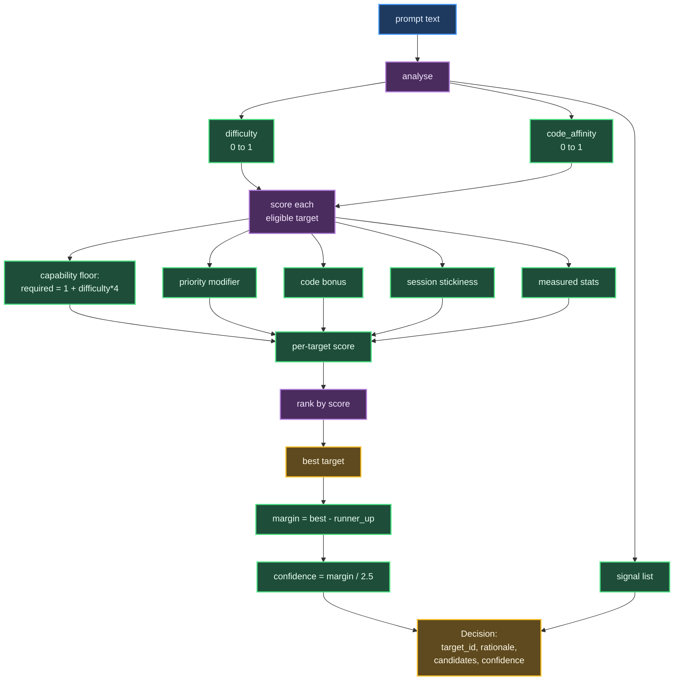

# Routing: Choosing a Target

Turnout routes each request to a target (an adapter-model pair) based on the request's content, constraints, and measured history. This document explains how routing works, starting with the data structures, then the policies.

## The Decision: Transparent, Detailed, Auditable

A routing decision is verbose by design. Transparency is the product. Every choice is explained; every candidate is scored; every signal that influenced the decision is named.

A `Decision` contains:

| Field | Meaning |
|-------|---------|
| `decision_id` | Unique ID for this routing decision |
| `request_id` | The request that prompted this decision |
| `target_id` | The chosen target |
| `router_name` | Which router made this decision (`manual`, `heuristic`, `switchyard`, `pinned` when a human bypassed routing, or a custom router) |
| `router_version` | The router's version string, so you can reason about decision stability across deployments |
| `rationale` | A human-readable summary of why this target was chosen |
| `candidates` | All eligible targets, scored and ranked, with per-target explanation of each score component |
| `fallback_order` | The order in which the executor should attempt fallback targets if the first one fails |
| `confidence` | A normalized measure of how close the winner was to the runner-up; a near-tie (low confidence) indicates uncertainty and a good moment to log the decision for analysis |
| `latency_ms` | How long the routing decision took |
| `eligible_ids` | Which targets passed the hard constraints and were eligible for scoring |
| `constraints_applied` | A log of which non-default constraints were in play: any hard constraint that filtered the candidate set (`allow_targets`, `deny_targets`, `require_local`), plus `priority=<value>` whenever it isn't `balanced` -- logged for visibility even though priority is a soft preference that doesn't remove targets |
| `raw` | Router-specific payload (e.g., the heuristic router includes the inferred difficulty and code affinity here) |
| `overridden` | `true` when a human `pin_target` overrode the router entirely |
| `propensity` | P(this target was chosen \| router state). Deterministic routers report `1.0`; an exploring router reports its actual sampling probability. Needed so training on recorded decisions doesn't just learn to imitate the router that produced them. |
| `explored` | `true` when this decision was a random exploration rather than the router's own preference, so training can weight or filter those rows. Set by the registered `explore` router (`EpsilonGreedyRouter`), which follows the heuristic 90% of the time and samples an eligible target uniformly the other 10%; a plain `random` router is also registered, always sampling uniformly. |

## Constraints: Hard Limits and Soft Preferences

The `Constraints` object holds what the caller cares about. A router must respect hard constraints; it should weigh soft preferences.

| Field | Type | Meaning |
|-------|------|---------|
| `priority` | `Priority` enum | One of `BALANCED`, `CHEAP`, `FAST`, or `QUALITY`. This is a soft preference; routers read it and may weight their scoring accordingly. |
| `allow_targets` | `list[str] \| None` | Hard allow-list. If set, only these target IDs are eligible. Applied BEFORE any router sees the candidate set. |
| `deny_targets` | `list[str]` | Hard deny-list. Targets here are removed from the eligible set. Applied BEFORE any router sees the candidate set. |
| `max_cost_usd` | `float \| None` | Maximum cost per request. Currently not enforced by the routers (reserved for future use). |
| `require_local` | `bool` | If `true`, only targets with `local=true` are eligible. Applied BEFORE any router sees the candidate set. |
| `pin_target` | `str \| None` | Human override: the target ID to always use. Bypasses the router entirely. If set, the decision is marked `overridden=true`. |

Hard constraints are applied once by `TargetCatalog.eligible(constraints)`, which filters the target list before any router is consulted. This ensures all routers work from the same candidate set and no policy can accidentally violate a hard constraint.

## The Manual Router: The Control Condition

The manual router exists to be the control condition in A/B comparisons. It always selects a configured default target, regardless of the prompt, the request history, or any other signal.

```python
class ManualRouter(BaseRouter):
    name = "manual"
    version = "1"
    
    def __init__(self, default_target: str):
        self.default_target = default_target
    
    async def decide(self, req: RoutingRequest, ctx: RoutingContext) -> Decision:
        # Choose the default, or fall back to the first eligible target if it is disabled.
        chosen = next((t for t in eligible if t.id == self.default_target), eligible[0])
        return self._decision(
            req, ctx,
            target_id=chosen.id,
            rationale=f"Fixed default target `{chosen.id}`. No routing logic applied.",
            candidates=[...],
            confidence=1.0,
        )
```

Any smarter router has to beat the manual router on the recorded data over a test period. If it cannot, the sophistication is not paying rent. The manual router is not, however, the fallback when another router fails: the router orchestrator catches the error and retries against the **heuristic** router instead (e.g., if the `switchyard` router's HTTP call to Switchyard fails), prefixing the resulting rationale with `[<router> unavailable: <error>]`. If the heuristic router itself is the one that raised, the error propagates instead of looping.

## The Heuristic Router: The Honest Baseline

The heuristic router is a transparent, hand-written policy with named signals and visible weights. Every rule is a pattern you can read and question. This is what a learned router will be measured against.

### The Analyse Step: Difficulty and Code Affinity

The heuristic router begins by reading the request's prompt text and computing two continuous scores: **difficulty** (0 to 1) and **code affinity** (0 to 1).

**Difficulty** starts at 0.30 (the baseline assumption). Signals then adjust it:

- **Hard patterns** (HARD_PATTERNS):
  - `architect|design|refactor|migrat|trade-?off|strategy` → "+hard: design/architecture wording" (+0.14 per hit, capped at 2)
  - `prove|derive|optimi[sz]e|complexity|algorithm` → "+hard: analytical wording" (+0.14 per hit, capped at 2)
  - `debug|root cause|why (?:does|is|isn'?t)|failing|regression` → "+hard: debugging wording" (+0.14 per hit, capped at 2)
  - `security|vulnerab|exploit|auth[eo]ri[sz]|crypto` → "+hard: security wording" (+0.14 per hit, capped at 2). Note the narrow `auth` match: it fires on "authorize"/"authorise" but not on bare "auth" or "authentication".
  - `step[- ]by[- ]step|think.{0,12}through` → "+hard: explicit reasoning request" (+0.14 per hit, capped at 2). The gap between "think" and "through" is capped at 12 characters, so it catches "think it through" but not "think" and "through" landing in unrelated parts of a long prompt.

- **Easy patterns** (EASY_PATTERNS):
  - `hi|hey|hello|thanks|thank you|ok|okay|yes|no` (at the start) → "-easy: greeting or acknowledgement" (-0.18)
  - `what is|what's|define|meaning of|spell|translate` → "-easy: lookup-style question" (-0.18)
  - `rename|rephrase|shorten|summari[sz]e|tidy|format` → "-easy: light text edit" (-0.18)

- **Length rules**:
  - > 6000 chars → "+hard: long prompt" (+0.25)
  - > 1500 chars → "+hard: sizeable prompt" (+0.12)
  - < 80 chars AND no hard hits → "-easy: very short prompt" (-0.15). The phrase "Prove P != NP" is short but not easy; brevity only counts as a signal when nothing else suggests depth.

- **Multi-turn**: > 3 user messages → "+hard: long multi-turn conversation" (+0.08)

**Code affinity** starts at 0.0. It increases by 0.3 per code-related pattern found, capped at 1.0:

- `\`\`\`` (code fence) → "+code: fenced code block"
- `function|class|def|import|const|async|SELECT|CREATE TABLE` → "+code: code keywords"
- `.py|.ts|.tsx|.js|.rs|.go|.java|.rb|.sql|.sh|.yaml|.toml|.json` → "+code: file extension"
- `stack ?trace|traceback|exception|compile error|panic` → "+code: error output"

The result is clamped to [0, 1] for both values.

### The Scoring Step: Capability Floor, Then Cost

Once difficulty and code affinity are known, the router scores every eligible target:

1. **Capability floor** (non-negotiable):
   - Compute required quality: `required = 1.0 + difficulty * 4.0`, giving a range of [1.0, 5.0].
   - If the target's `quality_tier < required`: penalize by `2.5 * (required - quality_tier)` per tier of deficit. An undersized model gets a severe penalty; it cannot win.
   - If the target's `quality_tier >= required`: grant +1.0. Now targets compete on cost.

   **Why this asymmetric design?** An earlier version treated distance from "ideal quality" symmetrically: penalize both under AND over the requirement. That made the cheapest model always win, because it was always "close enough" and saved money. The lesson: treat capability as a floor (you must meet it), and cost as a tiebreaker (prefer cheaper among the capable). This is a design choice, not an accident.

2. **Priority modifier**:
   - `CHEAP`: +1.1 * (6 - cost_tier). Cheaper targets get a bonus proportional to how cheap they are.
   - `FAST`: +1.1 * (6 - speed_tier). Faster targets get a bonus.
   - `QUALITY`: +1.1 * quality_tier. Higher-quality targets get a bonus.
   - `BALANCED` (default): +0.5 * (6 - cost_tier). A gentler cost preference, so high-quality decisions are not ruined by frivolous spend.

3. **Code affinity bonus** (conditional):
   - If `code > 0.3` AND the target has the `"code"` tag: +1.5 * code_affinity. Targets tuned for coding tasks get a boost.

4. **Session stickiness** (cheap win):
   - If the target served the previous turn in this session: +0.6 (configurable). Staying with the same model preserves the provider's cache and the conversational thread.

5. **Measured stats** (if available):
   - If the target has been used at least 3 times:
     - If `success_rate < 0.8`: penalize by `2.0 * (1 - success_rate)`. A failing model is demoted.
     - If `priority == FAST` and `avg_ttft_ms` is available: adjust by `max(-1.5, 1.5 - ttft / 4000.0)`. Very fast models get a small bonus; slow ones a small penalty.

The result is a single score per target, and targets are sorted by score (descending).

### Confidence: The Normalised Margin

Confidence is a measure of decision certainty. It is computed as:

```
margin = best_score - runner_up_score
confidence = min(1.0, max(0.05, margin / 2.5))
```

A large margin (> 2.5) gives confidence ≈ 1.0. A near-tie gives confidence ≈ 0.05, indicating a decision worth logging for later analysis (it might be worth exploring the runner-up). This number feeds back into the executor and UI, signalling when a decision is fragile.

## Heuristic Routing Pipeline



## Worked Example: Four Routing Decisions

Turnout is running at `http://127.0.0.1:8700`. Here are four example routing requests and how the heuristic and manual routers scored them:

### Example 1: Trivial Greeting (Easy)

**Request:**
```json
{
  "prompt": "Hi, how are you?",
  "routers": ["heuristic", "manual"]
}
```

**Heuristic Decision:**
- **Target:** `claude-haiku`
- **Rationale:** "difficulty 0.15, code affinity 0.00 -> `claude-haiku` (score +3.50, margin +0.00). Signals: -easy: very short prompt (16 chars)"
- **Top candidates:**
  - claude-haiku (3.50) — meets the bar; preferred because cheapest
  - copilot-gemini (3.50) — meets the bar; also cheap
  - claude-opus (1.50) — meets the bar; expensive

**Manual Decision:**
- **Target:** `claude-haiku`
- **Rationale:** "Fixed default target `claude-haiku`. No routing logic applied."

Both routers agree on the easy win. The heuristic's margin is 0.00 because two models tied at the top; confidence is low (0.05), a useful signal that this decision is fragile.

### Example 2: Architecture Design Problem (Hard)

**Request:**
```json
{
  "prompt": "Design a zero-downtime migration strategy for a 40TB Postgres cluster, and analyse the trade-offs of each approach.",
  "routers": ["heuristic", "manual"]
}
```

**Heuristic Decision:**
- **Target:** `claude-sonnet`
- **Rationale:** "difficulty 0.58, code affinity 0.00 -> `claude-sonnet` (score +2.50, margin +0.00). Signals: +hard: design/architecture wording (x2)"
- **Top candidates:**
  - claude-sonnet (2.50) — meets the bar (tier 4 >= required 3.3); cost-preferred
  - copilot-sonnet (2.50) — meets the bar; also tier 4
  - claude-opus (1.50) — meets the bar; more expensive, not preferred

**Manual Decision:**
- **Target:** `claude-haiku` (the default)
- **Rationale:** "Fixed default target `claude-haiku`. No routing logic applied."

The heuristic escalates to Sonnet (tier 4) based on difficulty. The manual router stubbornly picks Haiku (tier 2), which is under the bar for this task. A real execution would likely fail or be mediocre.

### Example 3: Debugging With Code (Hard + Code)

**Request:**
```json
{
  "prompt": "Debug this failing test: ```python\ndef test_migration():\n    assert calculate_cost() > 0\n```",
  "routers": ["heuristic"]
}
```

**Heuristic Decision:**
- **Target:** `claude-sonnet`
- **Rationale:** "difficulty 0.58, code affinity 0.60 -> `claude-sonnet` (score +3.40, margin +0.00). Signals: +hard: debugging wording (x2); +code: fenced code block; +code: code keywords"
- **Top candidates:**
  - claude-sonnet (3.40) — meets the bar; code-tagged; gets the code bonus
  - copilot-sonnet (3.40) — meets the bar; code-tagged; same score

The code affinity (0.60) triggers a +1.5 bonus for code-tagged targets, lifting them above non-code-specialized models. The heuristic recognizes this is not just hard; it is code-hard.

### Example 4: Easy Task With Quality Priority

**Request:**
```json
{
  "prompt": "Summarise this.",
  "priority": "quality",
  "routers": ["heuristic", "manual"]
}
```

**Heuristic Decision:**
- **Target:** `claude-opus`
- **Rationale:** "difficulty 0.00, code affinity 0.00 -> `claude-opus` (score +6.50, margin +0.00). Signals: -easy: light text edit; -easy: very short prompt (15 chars)"
- **Top candidates:**
  - claude-opus (6.50) — meets the bar; quality priority awards +1.1 * 5 (highest tier)
  - claude-sonnet (5.40) — meets the bar; quality priority awards +1.1 * 4

**Manual Decision:**
- **Target:** `claude-haiku` (the default)
- **Rationale:** "Fixed default target `claude-haiku`. No routing logic applied."

With quality priority, the heuristic picks the best model even for an easy task. The manual router is indifferent to the priority and always picks the default. This is the intended tradeoff: simplicity vs. expressiveness.

## How to Add Your Own Router

A router is any class implementing the `Router` protocol:

```python
from turnout.domain import Router, RoutingRequest, RoutingContext, Decision

class MyRouter:
    name = "myrouter"
    version = "1"
    
    async def decide(self, req: RoutingRequest, ctx: RoutingContext) -> Decision:
        """Choose a target and explain why.
        
        You have access to:
          - req.prompt_text: the full prompt
          - req.last_user_text: the last user message
          - req.constraints: hard and soft constraints
          - ctx.catalog: the full TargetCatalog; call ctx.catalog.eligible(req.constraints)
            yourself to get the hard-constraint-filtered list you must choose from
          - ctx.session_history: prior target IDs in this session, most recent first
          - ctx.target_stats: per-target success rates, TTFTs, etc.
        
        Return a Decision with:
          - target_id: the chosen target
          - rationale: human-readable explanation
          - candidates: list of Candidate(target_id, score, reasons) for all eligible targets
          - confidence: optional; helps the executor detect fragile decisions
        
        Rules (from the Router protocol's contract):
          - Do not execute anything -- no calling a model to get an actual answer.
            Consulting an external *decision* service is fine (the built-in
            `switchyard` router does exactly this, over HTTP, to ask Switchyard's
            /v1/decision endpoint which target to use).
          - Do not spawn subprocesses.
          - Do not hold credentials.
          - Do not retry. The executor handles retries.
          - You may inspect the database (target_stats) but must not mutate it.
        """
        chosen_id = "..."  # your logic here
        return self._decision(
            req, ctx,
            target_id=chosen_id,
            rationale=f"My reason: ...",
            candidates=[...],
            confidence=...,
        )
    
    async def health(self) -> tuple[bool, str]:
        """Is this router ready? Return (ok, detail).
        
        Used by the UI and the executor for fallback decisions.
        Keep it cheap; this may be called frequently.
        """
        return True, "ready"
```

Register your router in `turnout/registry.py`:

```python
def build_routers(cfg: TurnoutConfig) -> dict[str, object]:
    ...
    routers: dict[str, object] = {
        "manual": ManualRouter(cfg.default_target),
        "heuristic": heuristic,
        "random": RandomRouter(),
        "explore": EpsilonGreedyRouter(heuristic, epsilon=0.1),
        "myrouter": MyRouter(),  # add this line
    }
    ...
    return routers
```

Then use it:

```bash
turnout --config turnout.toml serve
# In another shell:
curl -X POST http://127.0.0.1:8700/api/route \
  -H 'Content-Type: application/json' \
  -d '{"prompt": "...", "routers": ["myrouter"]}'
```

`--config` is a top-level flag, not a `serve` option -- it must come before the subcommand (`turnout serve --config turnout.toml` is a parse error). The config is also read once at startup, so registering a new router is a code change: restart the server (or run `serve --reload` to have it restart itself on file changes) before `myrouter` is reachable. All routers are treated the same way: they are pure functions that read a request and context, return a decision, and never execute anything.

## What the Heuristic Does NOT Do

The heuristic router is transparent and hand-tuned, but it is deliberately simple. It does not:

- **Learn from feedback.** The signals are fixed. Once you record thousands of executions (successes and failures), a learned router can adapt. See `database.md` for how to train on the executions table.

- **Use the full request context.** It reads only the prompt text and a few extracted features. It does not inspect the session's prior execution history in detail, user profiles, or external APIs.

- **Adapt to provider availability.** If a provider goes down, the heuristic will still pick it (and the executor will fall back). A real production router could check provider status and avoid downed targets proactively.

- **Optimize for latency beyond tier estimates.** The `speed_tier` is a human guess. Once you have measured TTFT from real executions, a better router could use that to avoid slow targets when latency matters.

- **Cost-optimize within budget.** The `max_cost_usd` constraint is parsed but not enforced. A cost-aware router could track spend per session or user and adjust.

## See Also

- `database.md` — How the executions table captures routing decisions, outcomes, and measured stats.
- `architecture.md` — How to configure targets and adapters in `turnout.toml`, and how the executor uses a routing decision (selection, fallback chain, retries, result recording).
- `switchyard.md` — The `/v1/decision` wire contract the `switchyard` router speaks, and how targets map to the generated Switchyard config.
