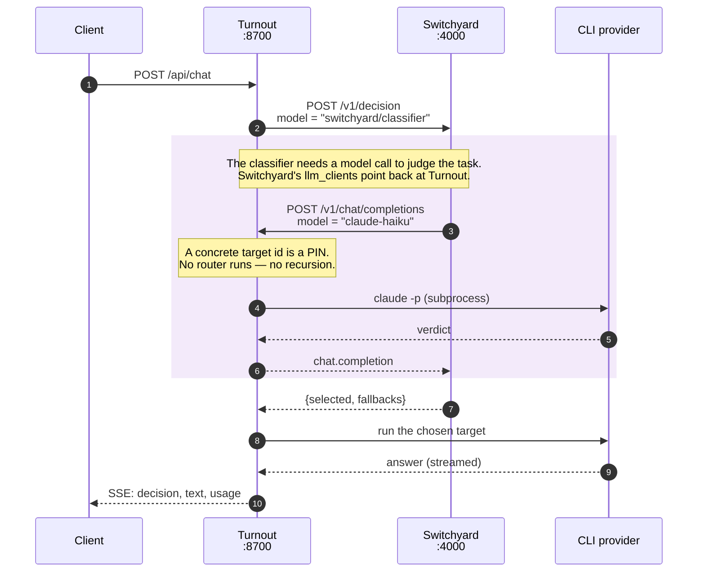

# NVIDIA NeMo Switchyard

Switchyard is a pre-alpha routing framework that selects which model should answer a request. Turnout integrates it as a pure decision component: Switchyard decides, and Turnout executes.

## The Design Problem and Solution

NVIDIA's Switchyard is normally deployed as an OpenAI-compatible *proxy*. A client sends a request, Switchyard both routes and executes it:

```
Client → [Switchyard: decide + execute] → Model
```

That does not fit Turnout's architecture. Turnout's providers are local CLI subprocesses already logged in via subscription auth (`claude login`, `copilot auth login`, `codex auth login`), not HTTP endpoints with API keys. They cannot be proxied at the HTTP layer.

The solution: use Switchyard's `/v1/decision` endpoint only, which answers *which target should serve this?* without making the answer call.

```
Client → [Turnout] → [Switchyard: decide] → [Turnout: execute] → Model
```

Turnout exports Switchyard as one interchangeable `Router` implementation. At runtime, Switchyard is a black box at a URL with a REST contract — it happens to answer routing questions. When Turnout decides to use Switchyard, it:

1. Sends a decision request (route id + messages)
2. Receives a target ID and fallback order
3. Executes on that target with its own provider clients
4. Records the decision and the outcome

## The /v1/decision Wire Contract

Switchyard listens on port 4000 (by default). POST `/v1/decision` takes a decision request and returns which target to use.

### Request Format

```json
{
  "input_format": "openai_chat",
  "request": {
    "model": "switchyard/classifier",
    "messages": [
      {"role": "user", "content": "hello"}
    ]
  }
}
```

Fields:
- `input_format` (required): One of `"openai_chat"`, `"anthropic_messages"`, or `"openai_responses"`. No default; the struct denies unknown fields.
- `request` (required): An object. The keys match an OpenAI chat completions request (`model`, `messages`, etc.).
- `request.model` (required): A route ID (e.g., `"switchyard/random"`, `"switchyard/classifier"`), not a model name. Route IDs are defined in the Switchyard config.
- `request.user` (optional): Turnout passes the session ID here, so Switchyard's notion of a session aligns with Turnout's own.

### Response Format

```json
{
  "selected": {
    "target": "codex_terra",
    "model": "codex-terra",
    "llm_client": {
      "format": "openai_chat",
      "base_url": "http://127.0.0.1:8700/v1"
    },
    "extra_body": {}
  },
  "fallbacks": [
    {
      "target": "claude_haiku",
      "model": "claude-haiku",
      "llm_client": {...},
      "extra_body": {}
    }
  ],
  "response": null
}
```

Fields:
- `selected`: The target Switchyard chose. Contains `target` (the TOML table key), `model` (the target's configured id), `llm_client` (how to call it), and `extra_body` (extra request fields for that target).
- `fallbacks`: A list of alternate targets in descending preference order, same shape as `selected`.
- `response` (optional): Present only if the route produced a preview response (e.g., a classifier's judgment call). Omitted if this was a decision-only route like `random`.

**Important:** Switchyard does not expose a confidence score or margin. Turnout reports `confidence=None` for the Switchyard router. Claiming a calibrated confidence would be an invention.

### Real Example

```bash
curl -sS -X POST http://127.0.0.1:4000/v1/decision \
  -H 'Content-Type: application/json' \
  -d '{"input_format":"openai_chat","request":{"model":"switchyard/random","messages":[{"role":"user","content":"hello"}]}}'
```

Response (prettified):

```json
{
  "selected": {
    "target": "codex_terra",
    "model": "codex-terra",
    "llm_client": {
      "format": "openai_chat",
      "base_url": "http://127.0.0.1:8700/v1"
    },
    "extra_body": {}
  },
  "fallbacks": [
    {
      "target": "claude_haiku",
      "model": "claude-haiku",
      "llm_client": {
        "format": "openai_chat",
        "base_url": "http://127.0.0.1:8700/v1"
      },
      "extra_body": {}
    },
    {
      "target": "claude_sonnet",
      "model": "claude-sonnet",
      "llm_client": {...},
      "extra_body": {}
    }
  ]
}
```

The `random` route chose `codex-terra`, with fallbacks in random order.

## The Generated Config and the Loop-Back Trick

When you run `turnout switchyard write-config`, Turnout generates a TOML config from your target catalog. The file lives at `config/switchyard.generated.toml`.

The key insight: every `llm_client` points back at Turnout itself, on `/v1/chat/completions`. This closes the loop.

```toml
[llm_clients.turnout]
format = "openai_chat"
base_url = "http://127.0.0.1:8700/v1"
```

All targets use this client:

```toml
[targets.claude_haiku]
id = "claude-haiku"
llm_client = "turnout"

[targets.codex_sol]
id = "codex-sol"
llm_client = "turnout"
```

Why does this matter? Some Switchyard routes — like the `llm_classifier` — need to make a real model call to reach a decision. For example, the classifier asks "is this task hard?" to decide between two targets. By pointing back at Turnout, that classifier call runs on the same CLI providers as everything else, with no API keys and no separate execution path.

There is no recursion risk. When the classifier's judgment call arrives at Turnout with `model` set to `"claude-haiku"` (a concrete target id), Turnout treats it as a pin and executes directly without consulting a router.

### Sequence Diagram



Measured on this machine: Switchyard's own decision overhead is about **20 ms**
(`switchyard/random`). The `switchyard/classifier` route adds roughly **20 seconds**
on a new session — all of it the boxed judgment call above, because it is served by a
CLI subprocess rather than a hot HTTP endpoint. `classify_trigger = "new_session"`
means that cost is paid once per conversation, not once per turn.

Note the direction of steps 3-6: Switchyard never calls a provider directly. Its `llm_client` for every target points back at Turnout (see the generated config below), so the classifier's own judgment call is itself a Turnout request — `model="claude-haiku"`, which Turnout treats as a pin and executes directly (step 4) rather than routing it again. Every call that reaches a provider goes through Turnout, including Switchyard's own routing-time calls.

### Routes in the Generated Config

The generator always creates four routes, using tiers picked from your target catalog:

**`random` route** (id: `switchyard/random`)

```toml
[routes.random]
id = "switchyard/random"
type = "random"
targets = ["claude_haiku", "claude_sonnet", "claude_opus", "copilot_auto", ...]
```

Uniform random over every target. Useful as an exploration policy — it produces the unbiased data a learned router needs to train on.

**`passthrough` route** (id: `switchyard/passthrough`)

```toml
[routes.passthrough]
id = "switchyard/passthrough"
type = "passthrough"
target = "claude_haiku"
```

Always selects the Turnout default target (selected by quality tier). The control condition.

**`classifier` route** (id: `switchyard/classifier`)

```toml
[routes.classifier]
id = "switchyard/classifier"
type = "llm_classifier"
mode = "capability"
classifier_target = "claude_haiku"
strong_target = "codex_sol"
weak_target = "claude_haiku"
base_threshold = 0.5
classify_trigger = "new_session"
message_hash_fallback = true
```

Switchyard's main routing algorithm. A cheap model (the classifier) judges how hard the task is. If the score is above the threshold, the request goes to the strong target. Otherwise, it goes to the weak target. The classifier runs once per new session (`classify_trigger = "new_session"`).

This is the real cost: a classifier call adds latency on every new session — measured at roughly 20 seconds with these CLI providers (see Classifier Latency below).

**`stage` route** (id: `switchyard/stage`)

```toml
[routes.stage]
id = "switchyard/stage"
type = "stage_router"
capable_target = "codex_sol"
efficient_target = "claude_haiku"
picker = "efficient_first"
confidence_threshold = 0.5
recent_turn_window = 3
```

Start cheap, escalate when the weak model shows signs of stalling. Useful for long conversations where task difficulty may change mid-session.

### Turnout Registers Two Switchyard Routers, Not One

The generated Switchyard config defines four routes, but Turnout itself only exposes two of them as selectable routers by default, via `[switchyard.routes]` in `turnout.toml`:

```toml
[switchyard.routes]
switchyard        = "switchyard/classifier"
switchyard-random = "switchyard/random"
```

`SwitchyardConfig.routes` (`turnout/config.py`) carries this exact mapping as its default even if `turnout.toml` omits the table. `build_routers()` (`turnout/registry.py`) loops over it and constructs one `SwitchyardRouter` instance per entry, so both `switchyard` (the classifier route — pays the ~20s judgment call) and `switchyard-random` (the random route — no judgment call, no extra latency) show up in `h.routers` and can be selected by name via `POST /api/router` or a per-request `"router"` field. The `passthrough` and `stage` routes exist in the generated TOML and are reachable directly against Switchyard's own `/v1/decision` endpoint, but neither has a Turnout router registered for it by default — add an entry to `[switchyard.routes]` to expose one.

## Mapping Decisions Home

When Switchyard returns `{"selected": {"model": "codex-terra", "target": "codex_terra", ...}}`, Turnout must resolve this back to a target ID in its catalog.

Turnout does this in two ways:

1. **Direct mapping via `model` field**: If `selected.model` matches a known target ID in Turnout's catalog, use it. This works for generated configs, because the generator sets `model = "<target-id>"` in every target block.

2. **Fallback via `target` field**: If `model` is not in the catalog, un-mangle the TOML table name. The generator maps:
   - `"claude-haiku"` → TOML key `"claude_haiku"` (replace `-` with `_`, replace `.` with `_`)
   - This fallback handles configs that were not generated by Turnout.

```python
def resolve(entry: dict) -> str | None:
    model = entry.get("model")
    if model and ctx.catalog.get(model):
        return model
    return target_from_switchyard_name(entry.get("target", ""), ctx.catalog.targets)
```

### Constraints and Substitution

Switchyard has no view of Turnout's request constraints (e.g., "use only targets with quality tier ≥ 4"). A target Switchyard picks may be ineligible.

When this happens, Turnout honours its own constraints and substitutes an eligible fallback:

```python
eligible_ids = {t.id for t in eligible}
if selected not in eligible_ids:
    replacement = next((f for f in fallbacks if f in eligible_ids), None)
    if replacement is not None:
        note = f" (switchyard chose `{selected}`, excluded by constraints)"
        selected = replacement
```

The rationale records this substitution so you can see which constraints blocked Switchyard's choice.

If neither Switchyard's selection nor any of its fallbacks are eligible, Turnout raises an error. This should be rare — the fallback list is typically long.

## Commands

Turnout manages Switchyard via the `turnout switchyard` subcommand.

### Generate the Config

```bash
turnout switchyard write-config
```

Reads Turnout's target catalog and writes `config/switchyard.generated.toml`. Output:

```
wrote config/switchyard.generated.toml
```

The config is generated fresh every time you run this. Do not edit it by hand — edit Turnout's config instead.

### Validate the Config

```bash
turnout switchyard validate
```

Generates the config and runs Switchyard's config parser in dry-run mode:

```
server OK: switchyard/classifier, switchyard/passthrough, switchyard/random, switchyard/stage
$ switchyard-server --config config/switchyard.generated.toml --dry-run
```

This checks that all route ids are valid, all target references exist, and the TOML syntax is correct.

### Run the Server

```bash
turnout switchyard serve
```

Generates the config and starts the Switchyard server listening on `127.0.0.1:4000`. The process remains in the foreground. Log output appears on stderr.

```
$ switchyard-server --config config/switchyard.generated.toml --host 127.0.0.1 --port 4000 --routing-log-file data/switchyard-routing.jsonl
```

You can add other flags (e.g., `--port 4001`) via the subprocess call, but currently Turnout does not expose them as CLI flags.

### Server Flags (for reference)

The Switchyard server accepts:

- `--config <path>`: TOML config file (required)
- `--host <addr>`: Listen address (default: `0.0.0.0`, all interfaces)
- `--port <num>`: Listen port (default: `4000`)
- `--dry-run`: Validate config and exit
- `--routing-log-file <path>`: Append a JSONL record per **proxied** request. See the
  caveat below: it records nothing for `/v1/decision` calls.

## Limits and Honest Caveats

### Pre-Alpha Upstream

Switchyard is pre-alpha (`v0.2.0`). The API may change. No backwards compatibility guarantee.

### No Confidence Score

Switchyard does not expose a score or margin in the decision response. Turnout reports `confidence=None` for this router rather than inventing one. If you need calibrated confidence for A/B testing or decision tracking, you have options:

1. Post-process Turnout's decision log and compute a confidence based on the route type (e.g., "random = 0", "classifier = 0.7" when above threshold).
2. Patch Turnout to ask Switchyard for its internal score via a different endpoint (if available in a later version).
3. Use a different router.

### Route Types Are Closed

Switchyard defines routes as a Rust enum. You cannot write custom routes. The types available in v0.2.0 are:

- `random`: Uniform random selection
- `passthrough`: Always return one target
- `noop`: Returns a fixed `OK` response without calling any model; for smoke-testing a deployment
- `stage_router`: Cheap-first with escalation
- `llm_classifier`: Judge task difficulty and pick strong or weak
- `advisor`: Executor + advisor pattern for long conversations

If you need a different algorithm, you either wait for an upstream addition or switch routers.

### Classifier Latency

The `llm_classifier` route runs a model call once per new session. Switchyard's own decision overhead is about 20ms; on top of that, the classifier's judgment call is a real model call executed through Turnout's CLI providers, measured at roughly 20 seconds per new session (source: `turnout.toml`, `[switchyard.routes]` comment). Plan for it in user-facing applications — it lands once per new session, not on every turn.

### Switchyard's Own Telemetry Is Inert in Decision-Only Mode

This is the one surprise worth knowing about. Switchyard's built-in observability
only counts traffic it *proxied*; a `/v1/decision` call is invisible to it.

Measured on this machine: after roughly ten `/v1/decision` calls, `GET /v1/stats`
still reported `total_requests: 0` and `--routing-log-file` was still a zero-byte
file. A single request through the proxy path immediately wrote one line:

```json
{"ts":"2026-08-22T21:16:24.829Z","model":"copilot-sonnet","prompt_tokens":3652,
 "cached_tokens":0,"completion_tokens":5,"reasoning_tokens":0,"total_tokens":3657}
```

So in Turnout's default decision-only mode, do not look to Switchyard's `/v1/stats`,
`/metrics`, or routing log for anything. Turnout's database is the sole source of truth,
which is the right outcome anyway: Turnout is the component that actually observes
execution, so it is the component that should own the telemetry.

### Config Format Changes

The TOML schema is part of the pre-alpha guarantee. If Switchyard changes its config format, you may need to regenerate and adjust the generated TOML. Turnout's code is independent — the glue is in `switchyard_config.py` — so changes should be localized.

## The Other Topology: Switchyard as a Full Proxy

Turnout uses decision-only mode, but because the generated config points every
`llm_client` at Turnout, Switchyard's normal proxy path also works — and it was
verified end to end:

```bash
curl -sS -X POST http://127.0.0.1:4000/v1/chat/completions \
  -H 'Content-Type: application/json' \
  -d '{"model":"switchyard/random","messages":[{"role":"user","content":"Reply with exactly: proxied"}]}'
# -> {"model": "copilot-sonnet", ... "content": "proxied"}
```

Switchyard picked a target, called Turnout as an OpenAI backend, Turnout ran the
Copilot CLI, and the answer came back through Switchyard. Pointing GitHub Copilot CLI at
port 4000 instead of 8700 works too, producing a four-hop chain across three vendors'
tooling with no API key anywhere:

```bash
COPILOT_PROVIDER_BASE_URL=http://127.0.0.1:4000/v1 \
COPILOT_PROVIDER_TYPE=openai COPILOT_PROVIDER_WIRE_API=completions \
COPILOT_MODEL=switchyard/random copilot -p "hello" --allow-all-tools
# Copilot CLI -> Switchyard -> Turnout -> Codex CLI -> OpenAI
```

Use this mode when you want Switchyard's own session affinity and routing log. Use the
default decision-only mode when you want Turnout to own execution, telemetry, and
fallback — which is what makes the router swappable in the first place.

## How to Swap Switchyard Out

Switchyard is pluggable. The router is not special — it is one `SwitchyardRouter` instance among several registered in `turnout/registry.py`. To use a different router:

1. Implement the `Router` protocol (defined in `turnout/domain.py`: `name`, `version`, `async def decide(...)`, `async def health(...)`). Subclassing `BaseRouter` from `turnout/routers/base.py` is the easiest way, since it supplies the `_decision(...)` helper that fills in eligibility, fallback order, and constraint bookkeeping:

```python
class MyRouter(BaseRouter):
    name = "my_router"
    version = "1"

    async def health(self) -> tuple[bool, str]:
        # Return (is_healthy, status_message)
        ...

    async def decide(self, req: RoutingRequest, ctx: RoutingContext) -> Decision:
        # Return a Decision object with selected target, rationale, candidates
        ...
```

2. Register it in `build_routers()` in `turnout/registry.py`:

```python
def build_routers(cfg: TurnoutConfig) -> dict[str, object]:
    routers: dict[str, object] = {
        "manual": ManualRouter(cfg.default_target),
        "heuristic": heuristic,
        "my_router": MyRouter(),   # add this line
        ...
    }
    return routers
```

There is no config-file switch for this — Turnout has no `[routing.use]` table. A router only exists if `build_routers()` puts it in the dict; `[turnout] default_router` in `turnout.toml` then names which registered router is active by default, and `POST /api/router` can change it at runtime.

See `routing.md` in this repo for the full `Router` protocol, the `Decision` object, and the other routers already registered this way: `manual`, `heuristic`, `random`, `epsilon-greedy` (`routers/explore.py`), and the Switchyard-backed `switchyard` / `switchyard-random` pair described above.

---

## Generated Config Reference

**File:** `config/switchyard.generated.toml`

The generator produces:

```toml
# GENERATED by turnout.switchyard_config -- do not edit by hand.
# Regenerate with:  turnout switchyard write-config

schema_version = 1

[llm_clients.turnout]
format = "openai_chat"
base_url = "http://127.0.0.1:8700/v1"

# Every target in your catalog maps to a [targets.*] block:
[targets.claude_haiku]
id = "claude-haiku"
llm_client = "turnout"

[targets.codex_sol]
id = "codex-sol"
llm_client = "turnout"

# ... and four routes

[routes.random]
id = "switchyard/random"
type = "random"
targets = [...]

[routes.passthrough]
id = "switchyard/passthrough"
type = "passthrough"
target = "claude_haiku"

[routes.classifier]
id = "switchyard/classifier"
type = "llm_classifier"
mode = "capability"
classifier_target = "claude_haiku"
strong_target = "codex_sol"
weak_target = "claude_haiku"
base_threshold = 0.5
classify_trigger = "new_session"
message_hash_fallback = true

[routes.stage]
id = "switchyard/stage"
type = "stage_router"
capable_target = "codex_sol"
efficient_target = "claude_haiku"
picker = "efficient_first"
confidence_threshold = 0.5
recent_turn_window = 3
```

Do not edit this file. Regenerate it with `turnout switchyard write-config` whenever you change targets.
